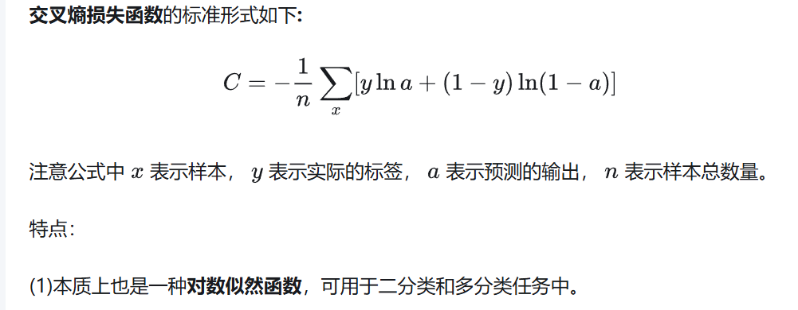

# loss function summary

## 定义与作用

损失函数(亦称成本函数或误差函数)是将事件或变量值映射至实数域的函数, 其数值直观体现与该事件相关的"代价". 优化问题的核心目标即是最小化损失函数.

在机器学习领域, 损失函数可用于通过计算模型预测与正确标准答案之间的偏差来测量模型性能. 优化模型需调整模型参数, 以最小化某些损失函数的输出.

简单来说, **损失函数追踪人工智能(AI)模型输出的错误程度**. 它通过量化给定输入的预测值(即模型输出)与实际值或标准答案之间的差异(损失)来实现. 如果模型的预测值准确, 则损失会很小; 如果预测值不准确, 损失就很大.


## 优化如何工作

梯度下降等优化算法通常使用损失函数的梯度, **梯度是多变量函数的导数**. 从本质上讲, 导数描述了函数输出在任何点变化的速率和数量. 因此, 损失函数必须是可微分的; 换句话说, 在所有点上都有导数.

机器学习模型通过调整某些模型参数, 学会进行准确预测. 例如, 一个简单的线性回归算法使用函数 y = wx + b 对数据进行建模, 其中 y 是模型输出, x 是输入, w 是权重, b 是偏差. 该模型通过更新权重和偏置项进行学习, 直到充分最小化损失函数.

使用损失函数的梯度, 优化算法确定向哪个方向"步进"模型参数, 以便沿梯度向下走, 从而减少损失.

## 回归损失函数

回归问题(例如线性回归或多项式回归)通过确定一个或多个自变量(x) 与因变量(y)之间的关系来输出连续值：给定x, 预测 y 的值. 因此, 回归损失不仅要对输出是否错误敏感, 还要对输出与标准答案的偏差程度敏感.

### 均方误差(MSE)

均方误差损失函数, 也称为 L2 损失或二次损失, **通常是大多数回归算法的默认函数**. 顾名思义, **MSE 就是所有训练样本中预测值和真实值之间的平方差的平均值**. 计算 n 个数据点的 MSE 的公式写为 1n∑i=1n(yi-yi^)2, 其中 y 是真实值, ŷ 是预测值.

对误差进行平方意味着结果值始终为正: 因此, MSE 仅评估误差的大小, 而不评估其方向. 对误差进行平方还会使大误差对整体损失产生不成比例的严重影响, 这会强烈惩罚异常值并激励模型减少异常值. 因此, 假设目标输出具有正态(高斯)分布时, MSE 是合适的.

### 平均绝对误差(MAE)

平均绝对误差或 L1 损失, 用于衡量预测值和实际值之间的平均绝对差. 与 MSE 一样, MAE 始终为正值, 不会区分过高或过低的估计值, 计算方法是所有误差的绝对值之和除以样本数量.

由于 MAE 不会对每个损失值求平方, 因此, MAE 比 MSE 更能抵御异常值. 因此, 当数据可能包含一些不应对模型产生过大影响的极值时, MAE 是理想的选择. 与 L2 损失相比, L1 损失对较小误差的惩罚力度更大.


## 分类损失函数

分类问题以及用于优化解决这些问题的模型的损失函数分为二元 分类(例如 "垃圾邮件"或"非垃圾邮件"、"批准"或"拒绝")或 多类 分类.

多类分类问题可以通过两种方法解决. 一种是计算数据点属于每个潜在类别的相对概率, 然后选择概率最高的类别. 这种方法通常由神经网络采用, 对输出层的神经元使用 softmax 激活函数. 另一种方法是将问题划分为一系列二元分类问题.

### 交叉熵损失函数(CrossEntropyLoss)

大多数情况下, 分类损失均会以熵为单位进行计算. 通俗来说, "熵"是指对某一系统内不确定性的衡量. 举个直观的例子, 通过将抛硬币与掷骰子进行比较可发现: 前者的熵较低, 因为抛硬币(2)的潜在结果数比掷骰子(6)更少.

在监督学习中, 会将模型预测与数据标签提供的标准答案分类进行比较. 这些标准答案标签是确定的, 因此熵值会较低或为零. 于是, 我们可根据使用标准答案标签的确定性与模型预测的标签的确定性之间的差异来衡量损失.

交叉熵损失(CEL)的计算公式源自 Kullback-Leibler 散度(KL 散度), 后者测量两个概率分布之间的差异. 最终, 最小化损失时需对分配给每个潜在标签的概率的真实分布与模型预测的每个标签的相对概率之间的差异进行最小化, 具有 **误差大的时候, 权重更新快; 误差小的时候, 权重更新慢** 的良好性质.




## YOLO 损失函数

YOLO系列模型的损失函数是其核心设计之一, 它通过多任务损失(Multi-task Loss)​联合优化目标检测的多个子任务(分类、定位、目标置信度). 不同版本的YOLO对损失函数有细节调整, 但核心思想一致, 通常包含三部分(假设输入图像被划分为 S×S 的网格, 每个网格预测 B 个边界框):

[yolo损失函数代码实现参考](https://github.com/eriklindernoren/PyTorch-YOLOv3/blob/master/pytorchyolo/utils/loss.py)

```
  _____________________________________________________________
 | YOLO Loss = λ_coord*(Localization) + Confidence + Classification
 |           (λ_coord=5)  |               |               |
 |________________________|_______________|_______________|
            |                   |                   |
            v                   v                   v
   _________________    _________________    _________________
  |   Coord Loss    |  |  Conf Loss      |  |  Class Loss     |
  | (仅正样本计算)   |  | (正负样本加权)  |  | (仅正样本计算)   |
  |-----------------|  |-----------------|  |-----------------|
  |  (x - x̂)²       |  |  BCE(C, 1)      |  |  BCE(p(c), p̂(c))|
  |  (y - ŷ)²       |  |  (λ_obj=1.0)    |  |  (λ_class=0.5)  |
  |  (w - ŵ)²       |  |                 |  |                 |
  |  (h - ĥ)²       |  |  + λ_noobj *    |  |                 |
  |  (λ_coord=0.05)    |  |    BCE(C, 0)    |  |                 |
  |                 |  |  (λ_noobj=0.5)  |  |                 |
  |_________________|  |_________________|  |_________________|

```

- **边界框坐标损失(Coord Loss, 权重通常 0.05)**: 优化预测框(bbox)的中心坐标 (x,y) 和宽高 (w,h) 与真实框的误差. 
    + 使用 ​MSE​​ 或 ​CIoU Loss​(YOLOv4之后代替简单的平方误差)
    + 仅对负责预测目标的边界框​(即与真实框IoU最大的预测框)计算损失

- **目标置信度损失(Conf Loss, 权重通常 1.0)**: 衡量预测框是否包含目标(二分类问题, 使用二元交叉熵). 由于大多数预测框不包含目标(负样本), 需通过权重 λ (通常为0.5)抑制负样本的影响.

- **分类损失(Class Loss, 权重通常 0.5)**: 对每个网格预测的类别概率(多分类)计算交叉熵损失.

