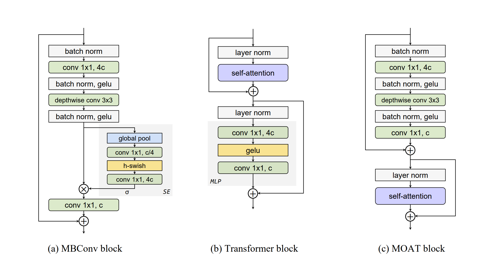

# MBConv头
MBConv全称: ​Mobile Inverted Bottleneck Convolution, 通过倒置瓶颈结构和深度可分离卷积实现高效特征提取.
基于: MobileNetV2: Inverted Residuals and Linear Bottlenecks. 
架构图依然可参考: 

如下分析代码基于 moat 模型中的 mbconv 实现.

## build(init)逻辑

```python

class MBConvBlock(tf.keras.layers.Layer):
  def __init__(self, **config):
    self._config = self._retrieve_config(config)
    super().__init__(name=self._config.name)

    # 定义基础函数
    self._activation_fn = self._config.activation
    self._norm_class = self._config.norm_class

  def build(self, input_shape: list[int]) -> None:
    input_size = input_shape[-1]
    
    # 升维维度计算, 默认为4倍
    inner_size = self._config.hidden_size * self._config.expansion_rate

    # 当输入通道数 input_size 与目标通道数 hidden_size 不一致时
    # 通过 1×1 卷积调整通道维度(stride也等于1), 确保残差相加操作维度一致
    self._shortcut_conv = None
    if input_size != self._config.hidden_size:
      self._shortcut_conv = tf.keras.layers.Conv2D(
          filters=self._config.hidden_size,
          kernel_size=1,
          strides=1,
          padding='same',
          kernel_initializer=self._config.kernel_initializer,
          bias_initializer=self._config.bias_initializer,
          use_bias=True,
          name='shortcut_conv')

    # 第一行, 执行norm
    self._pre_norm = self._norm_class(name='pre_norm')

    # 对应图中第二行: 升维(默认为4倍)
    self._expand_conv = tf.keras.layers.Conv2D(
        filters=inner_size,
        kernel_size=1,
        strides=1,
        kernel_initializer=self._config.kernel_initializer,
        padding='same',
        use_bias=False,
        name='expand_conv')

    # 第三行 执行norm
    self._expand_norm = self._norm_class(name='expand_norm')

    # 第四行 执行深度可分离卷积, 特点是参数量大幅减少(减少维度之间的联系)的同时, 尽量保持特征
    self._depthwise_conv = tf.keras.layers.DepthwiseConv2D(
        kernel_size=self._config.kernel_size,
        strides=self._config.block_stride,
        depthwise_initializer=self._config.kernel_initializer,
        padding='same',
        use_bias=False,
        name='depthwise_conv')

    # 第五行 执行norm
    self._depthwise_norm = self._norm_class(name='depthwise_norm')

    # 对应图中的se模块
    self._se = None
    if self._config.se_ratio is not None:
      se_filters = max(1, int(self._config.hidden_size * self._config.se_ratio))

      # 执行se模块, 具体参见后面分析
      self._se = SqueezeAndExcitation(
          se_filters=se_filters,
          output_filters=inner_size,
          kernel_initializer=self._config.kernel_initializer,
          bias_initializer=self._config.bias_initializer,
          name='se')

    # 最后一行, 降维回原来维度
    self._shrink_conv = tf.keras.layers.Conv2D(
        filters=self._config.hidden_size,
        kernel_size=1,
        strides=1,
        padding='same',
        kernel_initializer=self._config.kernel_initializer,
        bias_initializer=self._config.bias_initializer,
        use_bias=True,
        name='shrink_conv')

```

### SE 模块

如下这段代码实现的是MBConv中的SE(Squeeze-and-Excitation)模块.
核心是通过通道注意力动态提升特征判别力, 但仅增加少量参数, 计算代价可忽略

简要理解: 对 [B,H,W,C] 的输入 做一个全局平均池化 的动作, 输出形状[B,1,1,C]的权重矩阵, 相当于这个输出的权重矩阵**最后会对每一个特征通道(C维)做相乘动作, 将该特征通道中的平均值广播到整个H×W空间**. 这样子等价于通过权重放大对任务关键的通道(如分类中识别物体的特征通道), 抑制冗余通道(如背景噪声)

```python

class SqueezeAndExcitation(tf.keras.layers.Layer):

  def __init__(self, **config):
    self._config = self._retrieve_config(config)
    super().__init__(name=self._config.name)

    # 将全局平均池化后的特征压缩到更低维度(通道数减少), 相当于全连接层的降维操作
    # 压缩后的通道数(通常为C/r，r是压缩比)
    self._se_reduce = tf.keras.layers.Conv2D(
        # 压缩后维度 = self._config.hidden_size * self._config.se_ratio
        # 默认 se_ratio = 0.25, 也就是 1/4
        self._config.se_filters,

        kernel_size=1,
        strides=1,
        padding='same',
        use_bias=True,
        kernel_initializer=self._config.kernel_initializer,
        bias_initializer=self._config.bias_initializer,
        name='reduce_conv2d')

    # 将压缩后的特征恢复到原始通道数，相当于全连接层的升维操作
    self._se_expand = tf.keras.layers.Conv2D(
        # 升维, 操作后维度 = self._config.hidden_size
        self._config.output_filters,
        
        kernel_size=1,
        strides=1,
        padding='same',
        use_bias=True,
        kernel_initializer=self._config.kernel_initializer,
        bias_initializer=self._config.bias_initializer,
        name='expand_conv2d')
    self.activation_fn = self._config.activation

  def call(self, inputs: tf.Tensor) -> tf.Tensor:
    # 验证输入为4D张量[B,H,W,C]
    _ = inputs.get_shape().with_rank(4)

    # Squeeze阶段：全局平均池化[1,2](@ref), 输出形状[B,1,1,C]
    # 可以理解成[B,1,1,C]中的每个值对应 **一个通道** 的全局权重
    se_tensor = tf.reduce_mean(inputs, [1, 2], keepdims=True)

    # 如下这一行拆成多行, 方便分析
    # se_tensor = self._se_expand(self.activation_fn(self._se_reduce(se_tensor)))
    se_tensor = self._se_reduce(se_tensor)      # 降维, [B,1,1,C]→[B,1,1,C/r]
    se_tensor = self.activation_fn(se_tensor)   # 激活函数
    se_tensor = self._se_expand(se_tensor)      # 升维: [B,1,1,C/r]→[B,1,1,C]

    # Scale阶段：Sigmoid生成权重并加权[2,6](@ref)
    return tf.sigmoid(se_tensor) * inputs


```

## call(forward)


```python
def call(self, inputs: tf.Tensor, training: bool) -> tf.Tensor:
    # 保存输入张量作为残差连接的捷径分支(若输入输出通道数不同, 会通过1x1卷积调整维度)
    shortcut = self._shortcut_branch(inputs)

    # 卷积->归一化->激活(这里先扩展, 后面有压缩, 最后形成"扩展-压缩"的倒瓶颈结构)
    output = self._pre_norm(inputs, training=training)
    output = self._expand_conv(output)
    output = self._expand_norm(output, training=training)
    output = self._activation_fn(output)

    # 执行 深度可卷积函数, 具体见init分析
    output = self._depthwise_conv(output)
    output = self._depthwise_norm(output, training=training)
    output = self._activation_fn(output)

    # 执行se模块, 加强特征分离
    if self._se:
      output = self._se(output)

    # 降维压缩回原始维度(与输入通道数匹配), 完成倒瓶颈结构
    output = self._shrink_conv(output)
    output = residual_add_with_drop_path(
        output, shortcut,
        self._config.survival_prob, training)
        
    return output
```