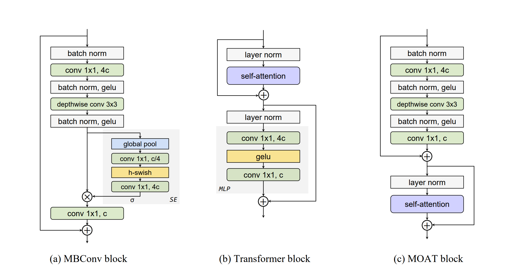

# moat block definitions

## 网络架构
网络架构图:


tiny_moat网络里一共有 7+2=9 个moat头, 经过mbconv下采样后才进入第一个moat block, 每个block的 height, width, input_size 如下:
```python

# 从最后一个mbconv过来的时候的维度
height: 32, width: 32, input_size: 160
height: 16, width: 16, input_size: 320
height: 16, width: 16, input_size: 320
height: 16, width: 16, input_size: 320
height: 16, width: 16, input_size: 320
height: 16, width: 16, input_size: 320
# 从本次moat(7个)组合block出去后的输出维度
height: 16, width: 16, input_size: 320

# 本次moat组合block(2个), 进来时的维度
height: 16, width: 16, input_size: 320
# 本次moat组合block出去后的输出维度, 这是最后一个moat block
# 到这个位置, 经过多次下采样后 height = origin_height/32(见第一张架构图最后一个维度)
height: 8,  width: 8,  input_size: 640
```

## 代码分析

### 初始化build分析


```python


class MOATBlock(tf.keras.layers.Layer):
  def build(self, input_shape: list[int]) -> None:
    # 调试打印日志如上, 一共有9个头
    height, width, input_size = input_shape[-3:]

    # 升维后的维度大小计算
    inner_size = self._config.hidden_size * self._config.expansion_rate

    # 确认输出维度, 所以这里一般经过计算后
    # 第一批次moat block h/w 都是 16/16, 第二批次为 8/8
    if self._config.window_size:
      if (isinstance(self._config.window_size, list) and
          len(self._config.window_size)) == 2:
        self._window_height = self._config.window_size[0]
        self._window_width = self._config.window_size[1]
      else:
        raise ValueError((
            'The window size should be a list of two ints',
            '[height, width], if specified.'))
    else:
      self._window_height = math.ceil(float(height) / self._config.block_stride)
      self._window_width = math.ceil(float(width) / self._config.block_stride)

    self._shortcut_conv = None

    # 当输入通道数 input_size 与目标通道数 hidden_size 不一致时
    # 通过 1×1 卷积调整通道维度(stride也等于1), 确保残差相加操作维度一致
    if input_size != self._config.hidden_size:
      self._shortcut_conv = tf.keras.layers.Conv2D(
          # 输出通道数，与目标维度对齐, 也就是将 输入input_size 调整为 输出 hidden_size
          filters=self._config.hidden_size,
          kernel_size=1,
          strides=1,
          padding='same',
          kernel_initializer=self._config.kernel_initializer,
          bias_initializer=self._config.bias_initializer,
          use_bias=True,
          name='shortcut_conv')

    # 对应moat block图中的第一行(具体也是call的计算第一行)
    self._pre_norm = self._norm_class(name='pre_norm')

    # 执行前面的升维操作, 前面是定义维度, 这里是卷积实现动作
    # 对应moat block图中的第二行: 升维至对应大小(默认值: 4倍)
    self._expand_conv = tf.keras.layers.Conv2D(
        filters=inner_size,
        kernel_size=1,
        strides=1,
        kernel_initializer=self._config.kernel_initializer,
        padding='same',
        use_bias=False,
        name='expand_conv')
    
    # 对应图中第三行, 执行norm
    self._expand_norm = self._norm_class(name='expand_norm')

    # 这里是一个深度卷积, 根据前面初始化可知, 只有第一个 block_stride 为2, 其余的为1
    # 对输入的每个通道独立进行空间卷积(不跨通道混合), 输出通道数默认等于输入通道数
    # 具体可参考 mbconv(移动卷积)中的定义, 核心是尽量保留特征的同时, 减少维度
    self._depthwise_conv = tf.keras.layers.DepthwiseConv2D(
        kernel_size=self._config.kernel_size,
        strides=self._config.block_stride,
        depthwise_initializer=self._config.kernel_initializer,
        padding='same',
        use_bias=False,
        name='depthwise_conv')

    # 对应norm
    self._depthwise_norm = self._norm_class(name='depthwise_norm')

    # 前面进行了 4c 升维动作, 这里降维回来 c
    self._shrink_conv = tf.keras.layers.Conv2D(
        filters=self._config.hidden_size,
        kernel_size=1,
        strides=1,
        padding='same',
        kernel_initializer=self._config.kernel_initializer,
        bias_initializer=self._config.bias_initializer,
        use_bias=True,
        name='shrink_conv')

    # 执行自注意力attention前norm一下, 也是图中倒数第二行
    self._attention_norm = tf.keras.layers.LayerNormalization(
        axis=-1,
        epsilon=self._config.ln_epsilon,
        name='attention_norm')

    scale_ratio = None
    if self._config.relative_position_embedding_type:
      if self._config.position_embedding_size is None:
        raise ValueError(
            'The position embedding size need to be specified ' +
            'if relative position embedding is used.')
      scale_ratio = [
          self._window_height / self._config.position_embedding_size,
          self._window_width / self._config.position_embedding_size,
      ]

    # 执行自注意力, 具体请参考 Attention 定义部分
    self._attention = Attention(
        hidden_size=self._config.hidden_size,
        head_size=self._config.head_size,
        relative_position_embedding_type=(
            self._config.relative_position_embedding_type),
        scale_ratio=scale_ratio,
        kernel_initializer=self._config.kernel_initializer,
        bias_initializer=self._config.bias_initializer)

```

### Attention头 分析


##### init 函数

```python

def __init__(self, **config):
    self._config = self._retrieve_config(config)
    super().__init__(name=self._config.name)

    # 标准的多头注意力计算, 得出多头的个数
    self._config.num_heads = self._config.hidden_size // self._config.head_size

    # 初始化 q/k/v 投影层
    # TrailDense的设计 是为了高效处理多头注意力机制中的多维投影问题
    # 相当于不需要手动 reshape 和 transpose 操作拆分多头和合并多头这些, 细节未研究:)
    self._q_proj = TrailDense(
        output_trailing_dimensions=[self._config.num_heads,
                                    self._config.head_size],
        kernel_initializer=self._config.kernel_initializer,
        bias_initializer=self._config.bias_initializer,
        name='q')
    self._k_proj = TrailDense(
        output_trailing_dimensions=[self._config.num_heads,
                                    self._config.head_size],
        kernel_initializer=self._config.kernel_initializer,
        bias_initializer=self._config.bias_initializer,
        name='k')
    self._v_proj = TrailDense(
        output_trailing_dimensions=[self._config.num_heads,
                                    self._config.head_size],
        kernel_initializer=self._config.kernel_initializer,
        bias_initializer=self._config.bias_initializer,
        name='v')

    # 输出层投影
    self._o_proj = TrailDense(
        output_trailing_dimensions=[self._config.hidden_size],
        input_begin_axis=-2,
        kernel_initializer=self._config.kernel_initializer,
        bias_initializer=self._config.bias_initializer,
        name='o')

    # 在注意力分数计算时缩放点积结果，防止因head_size较大导致梯度消失(标准计算)
    self._q_scale = self._config.head_size ** -0.5

```

##### build逻辑(含移位窗口解决相邻特征交互问题: swin transformer)

这里的核心是关注: <font color='red'>relative_position_embedding</font> 张量. 这一段还没理解, todo!
**设计动机**: 若原始编码尺寸较小(如 [15,15]), 直接插值到 [31,31] 可避免重新训练编码参数, 同时支持更大范围的相对位置建模（如高分辨率输入).


```python

# 这段代码实现了2D多头相对位置编码的构建过程
# 主要用于视觉Transformer(如Swin Transformer)中处理空间位置关系
def build(self, input_shape):
    if self._config.relative_position_embedding_type == '2d_multi_head':
      # 确保输入是4D张量（批处理后的图像特征图）
      if input_shape.rank != 4:
        raise ValueError(
            'The input shape should be [batch_size, height, width, channels]')
            
      input_shape_list = input_shape.as_list()
      height, width = input_shape_list[-3], input_shape_list[-2]

      # 打印日志显示: scale_ratio = [1.1428571428571428, 1.1428571428571428] = [8/7, 8/7]
      if self._config.scale_ratio is not None:
        if (isinstance(self._config.scale_ratio, list) and
            len(self._config.scale_ratio) == 2):
          height_scale, width_scale = self._config.scale_ratio
        elif isinstance(self._config.scale_ratio, float):
          height_scale = self._config.scale_ratio
          width_scale = self._config.scale_ratio
        else:
          raise ValueError(
              'scale ratio should be float or list of floats with length 2')

        # 这里本来的 height/width = 16(batch1) 或者 8(batch2)
        # 使用双线性插值调整编码尺寸, 相当于 2*round(16/8*7)-1 = 2*14-1=27
        # 实际运行结果: relative_position_embedding_height = 27(batch1)和13(batch2)
        relative_position_embedding_height = (
            2 * round(height / height_scale) - 1)
        relative_position_embedding_width = (
            2 * round(width / width_scale) - 1)
      else:
        relative_position_embedding_height = 2 * height - 1
        relative_position_embedding_width = 2 * width - 1


      relative_position_embedding_height_axis = 1

      # 定义相对位置编码的形状为 [num_heads, H', W']
      # 其中 H' 和 W' 是编码的原始高度和宽度(见前述计算, 结果为 [27, 27]及[13, 13])
      relative_position_embedding_shape = [
          self._config.num_heads,
          relative_position_embedding_height,
          relative_position_embedding_width]

      # 通过 add_weight 创建一个可训练的张量, 用于学习不同注意力头之间的相对位置偏置
      self.relative_position_embedding = self.add_weight(
          'relative_position_embedding',
          relative_position_embedding_shape,
          initializer=self._config.kernel_initializer,
          trainable=True)
      if self._config.scale_ratio is not None:
        # tf.expand_dims: 在张量的最后一维(axis=-1)插入一个大小为1的维度
        # 将形状从 [num_heads, H', W'] 变为 [num_heads, H', W', 1], 以便后续调整大小操作
        relative_position_embedding = tf.expand_dims(
            self.relative_position_embedding, axis=-1)

        # tf.image.resize: 使用双线性插值(默认)将编码张量从 [H', W'] 调整到目标尺寸
        # [2*height-1, 2*width-1], 覆盖所有可能的相对位置偏移, 也就是 [31, 31] 与 [15, 15]
        relative_position_embedding = tf.cast(
            tf.image.resize(relative_position_embedding,
                            [2 * height - 1, 2 * width - 1]),
            self.compute_dtype)

        # 移除之前添加的冗余维度(axis=-1), 恢复形状为 [num_heads, 2*height-1, 2*width-1]
        # 
        relative_position_embedding = tf.squeeze(relative_position_embedding,
                                                 axis=-1)
      else:
        relative_position_embedding = tf.cast(self.relative_position_embedding,
                                              self.compute_dtype)

      # 将相对位置编码转换为查询-键对的注意力偏置矩阵
      self.reindexed_position_embedding = reindex_2d_einsum_lookup(
          relative_position_embedding, height, width, height - 1, width - 1,
          h_axis=relative_position_embedding_height_axis)
    elif self._config.relative_position_embedding_type is None:
      self.reindexed_position_embedding = None

```


##### forward逻辑

```python

def call(self, query, training):
    _, h, w, channels = query.shape.as_list()
    query = tf.reshape(query, [-1, h * w, channels])

    q_heads = self._q_proj(query)
    k_heads = self._k_proj(query)
    v_heads = self._v_proj(query)
    q_heads *= self._q_scale

    attention_logits = tf.einsum('BSNK, BTNK -> BNST', q_heads, k_heads)

    if self.reindexed_position_embedding is not None:
      attention_logits += self.reindexed_position_embedding

    attention_probs = tf.cast(
        tf.nn.softmax(tf.cast(attention_logits, tf.float32), axis=-1),
        attention_logits.dtype)

    attention_out = tf.einsum('BNST, BTNK -> BSNK', attention_probs, v_heads)
    output = self._o_proj(attention_out)
    return output

```


### call(forward)

一些辅助函数分析:

```python

# 如下两个函数是Swin Transformer中实现窗口划分(Window Partitioning)
# ​和窗口还原(Window Merging)​的核心操作.

# Swin Transformer​: 用于局部窗口注意力计算, 配合移位窗口(Shifted Window)实现跨窗口信息交互
# ​高分辨率图像处理: 通过窗口划分降低计算负担, 支持大尺寸输入

# 将输入特征图划分为不重叠的局部窗口, 每个窗口大小为 (window_height, window_width)
def _make_wondows(self, inputs):
    # 输入形状: [batch, height, width, channels]
    _, height, width, channels = inputs.get_shape().with_rank(4).as_list()

    # 1. 分窗口: 将空间维度拆分为窗口网格
    # 注意: 这里采用了采用了非重叠窗口​(wh*ww)个子图, 如何避免将一个特征给切成2半了?
    # ai答复: 通过移位窗口(Shifted Window)机制解决了相邻特征交互的问题
    inputs = tf.reshape(
        inputs,
        (-1,
         height // self._window_height, self._window_height,
         width//self._window_width, self._window_width,
         channels))
        
    # 2. 转置: 调整维度顺序, 将窗口内部分块连续排列
    inputs = tf.transpose(inputs, (0, 1, 3, 2, 4, 5))

    # 3. 合并: 将窗口展平为独立样本(用于并行计算)
    inputs = tf.reshape(
        inputs,
        (-1, self._window_height, self._window_width, channels))

    return inputs

# 将分窗口后的特征图还原为原始空间结构
def _remove_windows(self, inputs, height, width):
    # 输入形状: [batch*n_h*n_w, win_h, win_w, channels]
    _, _, channels = inputs.get_shape().with_rank(3).as_list()

    # 1. 恢复窗口网格结构
    inputs = tf.reshape(inputs, [
        -1, height // self._window_height, width // self._window_width,
        self._window_height, self._window_width, channels
    ])

    # 2. 转置：还原原始空间顺序
    inputs = tf.transpose(inputs, (0, 1, 3, 2, 4, 5))

    # 3. 合并：拼接窗口恢复完整特征图
    inputs = tf.reshape(inputs, (-1, height, width, channels))

    return inputs


# 只有当 block_stride > 1时 执行下采样
# 也就是每一组block的第一个才会 > 1
def _shortcut_downsample(self, inputs, name):
    output = inputs
    if self._config.block_stride > 1:
      pooling_layer = tf.keras.layers.AveragePooling2D(
          pool_size=self._config.pool_size,
          strides=self._config.block_stride,
          padding='same',
          name=name,
      )
      if output.dtype == tf.float32:
        output = pooling_layer(output)
      else:
        # We find that in our code base, the output dtype of pooling is float32
        # no matter whether its input and compute dtype is bfloat16 or
        # float32. So we explicitly cast the output dtype of pooling to be the
        # model compute dtype.
        output = tf.cast(pooling_layer(
            tf.cast(output, tf.float32)), output.dtype)
    return output

def _shortcut_branch(self, inputs):
    shortcut = self._shortcut_downsample(inputs, name='shortcut_pool')
    if self._shortcut_conv:
      shortcut = self._shortcut_conv(shortcut)
    return shortcut

```


主流程:

```python
def call(self, inputs: tf.Tensor, training: bool) -> tf.Tensor:
    # 执行第一个下采样与卷积, 一般一组block中只有第一个block需要, 具体见 moat 架构图
    mbconv_shortcut = self._shortcut_branch(inputs)

    # 如下均为实现 mbconv 架构图中对应的 步骤, 参考初始化函数即可
    output = self._pre_norm(inputs, training=training)
    output = self._expand_conv(output)
    output = self._expand_norm(output, training=training)
    output = self._activation_fn(output)
    output = self._depthwise_conv(output)
    output = self._depthwise_norm(output, training=training)
    output = self._activation_fn(output)
    output = self._shrink_conv(output)

    # 残差合并输出
    output = residual_add_with_drop_path(
        output, mbconv_shortcut,
        self._config.survival_prob, training)

    # For classification, the window size is the same as feature map size.
    # For downstream tasks, the window size can be set the same as
    # classification's.

    # 开始执行自注意力层计算
    attention_shortcut = output # 保存当前输出作为注意力残差分支
    def _func(output):
      # 注意力输入归一化
      output = self._attention_norm(output)
      _, height, width, _ = output.get_shape().with_rank(4).as_list()

      # 分窗口处理(如Swin Transformer的窗口划分)
      output = self._make_wondows(output)

      # 窗口内多头注意力计算, 具体参考 attention 分析
      output = self._attention(output)

      # 恢复原始空间结构
      output = self._remove_windows(output, height, width)

      return output

    func = _func

    # 通过梯度重计算减少显存占用(牺牲时间换空间)
    # 属于性能优化, 可不细究
    if self._config.use_checkpointing_for_attention:
      func = tf.recompute_grad(_func)

    output = func(output) # 执行attention计算

    # 二次残差​: 注意力输出与原始特征合并, 保留低层信息
    output = residual_add_with_drop_path(
        output, attention_shortcut,
        self._config.survival_prob, training)

    return output

```