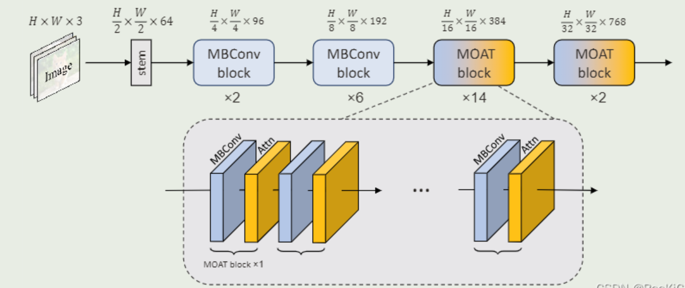

# MOAT Model
MOAT: Alternating Mobile Convolution and Attention Brings Strong Vision Models

### 摘要
MOAT是一种结合移动卷积（MBConv）和注意力机制的视觉骨干网络，通过将Transformer中的MLP替换为MBConv并调整模块顺序，显著提升了模型性能。在ImageNet-1K上达到89.1%的top-1准确率，并支持下游任务如目标检测（COCO 59.2% AP）和语义分割（ADE20K 57.6% mIoU）。其tiny版本也超越同类移动端模型，设计简洁高效

简要理解: 将MobileNet与Transformer二者结合起来, 创造一个新的网络块, 名字叫moat.

**网络架构图**

### 优势
1. ​高效融合MBConv与注意力​：通过替换MLP并调整模块顺序，增强局部与全局特征交互，提升模型性能
2. 对大分辨率图片无需切割即可通过滑动窗口进行预测
3. ​轻量化扩展性​：Tiny-MOAT系列在移动端超越MobileViT等模型，保持高效

### 劣势
1. ​计算成本较高​：大模型参数（如496M）需高算力，限制实时应用
2. ImageNet-22K预训练数据量和参数量较大, 对小数据集迁移效果可能受限, 微调时需保证数据量
3. ​局部窗口注意力局限​：大分辨率任务识别小目标, 需考虑优化

### 与其他相关模型对比 (ai总结)
| 模型       | 输入要求                | 高分辨率处理方式          | 小目标适配性               |
|------------|-------------------------|---------------------------|----------------------------|
| ​**MOAT**​   | 支持任意分辨率          | 局部窗口注意力+MBConv交互 | 优（隐式跨窗口信息融合）   |
| ​**Mask2former**​    | 支持任意分辨率    | 多尺度特征金字塔+掩蔽注意力机制         | 极优（但计算成本高） |
| ​**ViT**​    | 必须切割为固定大小块    | 分块+位置编码插值         | 差（全局注意力计算成本高） |
| ​**ConvNeXt**| 建议降采样至512×512     | 分层卷积堆叠              | 中等（静态感受野限制）     |

## 实现细节
todo

## 运行测试

## 插曲
在原作者讲解paper结束后的QA环节, 有人提问: 缺陷检测适合什么模型?
作者提到了: mask-rcnn \ Deformable DETR 甚至 yolo模型, 但是没提到自己的moat算法..
从查资料来看, moat依然是适合的, 而且与前述2个model相比, 计算量更小, 准确度更高, 因此值得尝试moat.

同时, 他提到了数据集准确性和多样性更重要, 这是必然的, 也和模型研究无关, 后续关注.

## 参考
1. code: https://github.com/RooKichenn/pytorch-MOAT / https://github.com/google-research/deeplab2
2. **原作者讲解paper**: https://www.bilibili.com/video/BV1Ps4y1s7Nw
3. paper翻译: https://zhuanlan.zhihu.com/p/588140131
4. deeplab预训练权重: https://github.com/google-research/deeplab2/blob/64bc1c1a6505b6cd1779b65f9127180840b8a4fa/g3doc/projects/moat_imagenet_pretrained_checkpoints.md
