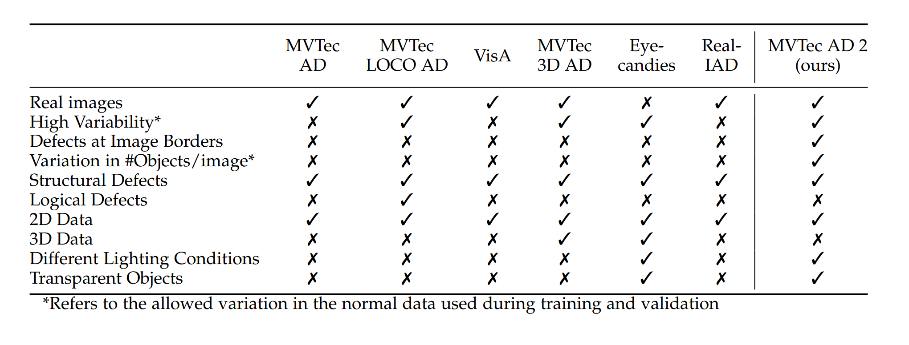
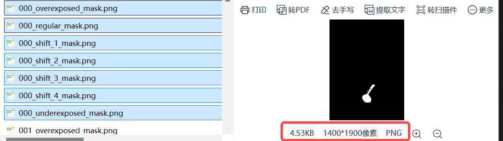

# dataset summary
一些数据集分析与记录

## 背景
对于缺陷检测来说, 数据集最重要的是缺陷定位和分类, 可以从公开数据集开始收集并完善.
最权威的是 Mvtec AD 数据集, 专门为缺陷检测而生, 且定位精度能到 3px*3px, 但缺点是他主要为无监督算法准备, 而我们预计还需要用有监督算法, 因此需要定义一个数据集格式, 可以用来训练及评估model性能.


## 数据集

### Mvtec AD 2
MVTec AD(MVTec Anomaly Detection)数据集是MVtec公司于2019年CVPR会议上发布的工业异常检测基准数据集, 为解决工业场景中缺陷检测的数据匮乏问题, MVTec AD模拟真实生产环境, 提供包含多种物体和纹理的高质量图像, 覆盖70余种缺陷类型(如划痕、凹痕、污染等)专为无监督异常检测任务设计. Mvtec ad2 比第一个版本数据更多更优秀, 尤其是透明物体.

[下载地址](https://www.mvtec.com/company/research/datasets/mvtec-ad-2/downloads)

#### 优缺点
1. 优点: 数据质量高, 精度高, 覆盖73种缺陷类型, 测试集样本提供精确的像素级二值掩码
2. 缺点: 专为无监督算法设计, 训练集仅含正常样本, 测试集包含正常与异常样本, 不适合其他有监督算法

这是mvtec ad paper 中介绍的与其他dataset对比的优势图: 

#### 文件格式
1. 高分辨率RGB图像(700×700至1400×1900), 部分类别为灰度图像(如网格、螺丝)
2. 目录: 按类别(15类, 如bottle、cable)划分, 每类包含train(仅正常样本)和test(正常+异常样本)子目录
3. 图片数量(如药瓶类别): 
   - train(正常)样本 291张
   - validation(正常)样本 41张; 
   - test样本分为:
      + public: good 35张; bad 105张, 每一张bad图片配有多个 ground_truth mask 文件
          
      + private: 276张, 不区分 good/bad, 用户需通过官方评估服务器提交预测结果才能获取性能反馈
      + private_mixed: 276张, good/bad 同上, 与private的区别是这个目录有一些复杂光照/背景.


### CoCo
COCO(Common Objects in Context)数据集是计算机视觉领域最权威的大规模多任务数据集之一, 由微软团队于2014年发布, 主要用于目标检测、实例分割、关键点检测和图像描述生成等任务.

- ​**数据规模​:**
    + ​总图像数​: 33万张(2017版本), 其中标注图像约20万张
    + ​标注对象​: 150万个实例, 覆盖80个目标类别(如人、车、动物)和91个背景类别(如天空、草地)
    + ​多模态标注​: 每张图像附带5个自然语言描述, 25万张人体图像含关键点标注

- **多任务支持​:**
    + 目标检测​: 提供边界框(Bounding Box)标注, 格式为[x, y, width, height]
    + 实例分割​: 像素级多边形或RLE格式掩码
    + ​关键点检测​: 人体17个关键点(如肘部、膝盖)
    + ​图像描述​: 每张图5句文本描述
    

#### 文件结构与标注格式
[目录与文件内容tiny版本](https://github.com/lizhogn/tiny_coco_dataset)
```
coco2017/
├── train2017/       # 训练图像
├── val2017/         # 验证图像
└── annotations/     # JSON标注文件
    ├── instances_train2017.json    # 目标检测/分割
    ├── person_keypoints_train2017.json  # 关键点
    └── captions_train2017.json     # 图像描述
```

train2017与val2017里面均为具体图片, 而annotations里面包含6个文件(上述只列了train的3个, 还有validation的), json内容人下: 
```json
{
  "images": [ // 所有images, file_name对应目录下文件; 
    {
        "id": 1,
        "file_name": "000001.jpg",
        "coco_url": "http://images.cocodataset.org/val2017/000000233771.jpg",
        "width": 640,
        "height": 480,
        "date_captured": "2013-11-18 05:20:56"
    },
  ],

  "annotations": [
    { // 给每个图片打的标记
        "id": 1,
        "image_id": 1,
        "category_id": 1,  // 类别ID（如"person"）
        "bbox": [10, 20, 30, 40],  // 边界框
        "segmentation": [[x1,y1,x2,y2,...]],  // 可选: 多边形坐标
        "keypoints": [x1,y1,v1,x2,y2,v2,...]  // 可选: 关键点（v=可见性）
    }
  ],

  "categories": [
    {
        "id": 1,
        "name": "person"
    }
  ]
}
```


### Ade20k
ADE20K 是 MIT 计算机视觉团队于2016年发布的大规模场景解析数据集, 专注于语义分割、实例分割和零部件分割任务. [官网地址](https://ade20k.csail.mit.edu/), 包含有每个类别信息, 图片大小信息等详细介绍.

- ​数据规模​:
    + 训练集​: 25,574张图像(2021年版本)
    + ​验证集​: 2,000张图像
    + 测试集​: 3,000张图像(部分未公开)

- 标注类别​:
    + ​150个常用类别​(SceneParse150基准, 含35个无定形背景类如天空/道路, 115个离散对象类如汽车/人)
    + ​完整标注​: 3,688个对象类别(含476个零部件类别, 如"车门" "窗户")
    + ​分辨率​: 图像平均尺寸为1.3M像素(约1280*1024, 中值长宽比4:3)

- ​多层级标注​:
    + ​语义分割​: 像素级类别标签(*_seg.png, RGB通道编码类别和实例ID)
    + ​实例分割: 区分同类不同对象(如多个人)
    + ​零部件分割​: 标注物体功能部件(如"椅子的坐垫")

#### 文件结构与标注格式

[目录与文件内容tiny版本](https://huggingface.co/datasets/qubvel-hf/ade20k-mini)
```
ADE20K_2021_17_01/
├── images/
│   ├── training/          # 训练图像（按场景分类）
│   │   └── cultural/apse__indoor/
│   │       ├── ADE_train_00016869.jpg          # 原图
│   │       ├── ADE_train_00016869_seg.png      # 对象掩码
│   │       ├── ADE_train_00016869_parts_1.png  # 零部件掩码
│   │       └── ADE_train_00016869.json         # 标注元数据
│   └── validation/        # 验证集（结构同训练集）
└── index_ade20k.pkl       # 统计信息（类别分布等）
```

##### png 格式说明

- ​ADE_train_xxx_seg.png​
    + R/G通道​: 联合编码对象类别ID, 采用16位存储(类别ID=R×256+G)
    + B通道​: 编码实例对象ID, 同一类别的不同实例具有连续编号(如person_1, person_2)
    + 技术特性：实例ID=0表示背景< 类别ID=0表示未标注区域

- ADE_train_xxx_parts_1.png​
    + 层级化部件标注，数字后缀表示部件层级（如1表示一级部件）
    + 编码规则与_seg.png相同，但仅包含属于父对象的部件区域

- ADE_train_xxx.json
todo


### Imagenet-2k / Imagenet-1k
ImageNet-1K含1000类120万张图像; ImageNet-2K扩展至2000类, 图片大小预计至250万张, 常用作预训练backbone(如ResNet、ViT)提取通用特征.

ImageNet-1K ​数据规模​：
- ​训练集​: 1,281,167 张图像(每类约 1300 张)
- ​验证集​: 50,000 张图像(每类 50 张)
- ​测试集​: 100,000 张图像(无公开标签, 需提交至官方评估服务器).
- 标注方式​：
    + 图像级标签: 每张图片对应一个类别标签(如"狗"、"猫")
    + ​部分任务(如目标检测)​: 提供边界框(bounding box)标注


## Ground Truth 标记介绍

#### PNG图片如何实现像素级定位？​
- 二值掩码(Binary Mask)​​：Ground Truth掩码是单通道(或三通道, 但仅黑白二值)PNG图像, 黑色(0)表示背景(正常区域), 白色(255)表示前景(异常区域)
- 像素对齐​：掩码与原图分辨率严格一致, 每个像素点一一对应. 例如, 原图中(x=100, y=200)的像素异常与否, 由掩码同位置像素值(0或255)决定
- 文件格式​：PNG是无损压缩格式, 可精确保留二值信息, 避免JPEG等有损压缩导致的边缘模糊

#### Ground Truth 里面多个文件的作用区分
文件夹内容可能有多张掩码对应一个图片, 如Mvtec ad2数据集中的bad部分:


对应每个文件作用如下:
```
ground_truth/
├── 000_overexpose_mask.png   # 第000号样本在过曝照明条件下的异常区域掩码
├── 000_underexpose_mask.png  # 第000号样本在欠曝照明条件下的异常区域掩码
├── 000_regular_mask.png      # 第000号样本在标准照明条件下的异常区域掩码
├── 000_shift_X_mask.png      # 第000号样本经过X方向位移​(如平移)后的异常区域掩码
└── ...
```

#### 模型评估
- ​像素级定位(P-AUROC):
模型输出的异常热力图(如PatchCore的局部特征距离图)与 **所有掩码变体(如overexpose_mask、shift_mask)** 逐像素对比, 计算曲线下面积(AUC). 例如, TransFusion通过透明度扩散生成的掩码用于量化模型在复杂光照下的定位精度
- ​图像级检测(I-AUROC)​​:
掩码变体帮助验证模型对多样异常(如合成位移缺陷)的敏感性. 例如, SimpleNet取异常图的最大分数作为图像级异常得分, 与掩码标注的异常类别匹配
- PatchCore仅使用正常样本​(无掩码)训练, 通过特征匹配建立正常样本的"记忆库". 模型输出异常热力图​(每个像素的异常分数), 与掩码对比计算指标(如AUROC、像素级F1)


## Summary
根据各dataset特征, 预计我们的模型训练与效果测试分为3个stage:
- Stage1 —— 义务教育: 采用各个model自己的预训练模型来认知这个世界, 如 imagenet 预训练数据等
- Stage2 —— 专业学习: 学习将各类收集到(包括我们自己的一些缺陷)的缺陷样本进行训练, 学好专业知识. 样本数需达 10k+ 级别
- Stage3 —— 定向突破​: 特定方向(缺陷)学习, 也就是带着解决问题的目标来学习, 定向突破训练. 样本数预计需 1k+ 级别

#### <font color='red'>使用格式</font>

经过初步讨论, 决定使用: **yolo 格式 [ classid, x y w h ]** 作为 训练/评估 的数据集格式.
classid: box 类别
x,y: 边界框中心点的水平/垂直坐标, 注意: 不是左上角或右下角, 是中心点
w,h: 表示边界框的完整宽度和高度, 注意: 不是一半, 是完整高度

## 引用
1. https://blog.csdn.net/qq_41742361/article/details/108352833 —— 数据集汇总文章
2. https://www.kaggle.com/datasets/kaustubhdikshit/neu-surface-defect-database —— 东北大学外表缺陷检测数据集, 最小精度据称在 5*5px
3. https://www.mvtec.com/company/research/datasets/mvtec-ad-2 —— mvtec公司无监督学习缺陷检测数据集, 最小精度在 3*3px
4. https://huggingface.co/datasets/Real-IAD/Real-IAD —— 工业缺陷数据集, 数据量很大, 涵盖了很多类别, 待研究
5. https://huggingface.co/datasets/DefectSpectrum/Defect_Spectrum —— HKUST(GZ), HKUST学校准备的缺陷数据集, 还配套有生成缺陷软件: https://github.com/EnVision-Research/Defect_Spectrum.

