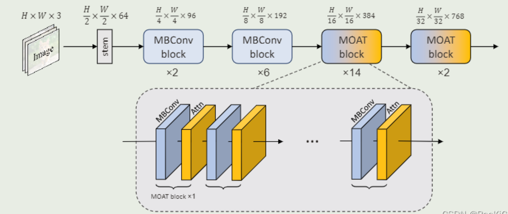

# MOAT Model
MOAT: Alternating Mobile Convolution and Attention Brings Strong Vision Models


### 摘要
MOAT是一种结合移动卷积（MBConv）和注意力机制的视觉骨干网络，通过将Transformer中的MLP替换为MBConv并调整模块顺序，显著提升了模型性能。在ImageNet-1K上达到89.1%的top-1准确率，并支持下游任务如目标检测（COCO 59.2% AP）和语义分割（ADE20K 57.6% mIoU）。其tiny版本也超越同类移动端模型，设计简洁高效

简要理解: 将MobileNet与Transformer二者结合起来, 创造一个新的网络块, 名字叫moat. 可以用来做目标分类, 也可以做目标检测甚至语义分割(官方版本只实现了目标分类的head头)

**网络架构图**



---

### 优势
1. ​高效融合MBConv与注意力​：通过替换MLP并调整模块顺序，增强局部与全局特征交互，提升模型性能
2. 对大分辨率图片无需切割即可通过滑动窗口进行预测
3. ​轻量化扩展性​：Tiny-MOAT系列在移动端超越MobileViT等模型，保持高效


### 劣势
1. ​计算成本较高​：大模型参数（如496M）需高算力，限制实时应用
2. ImageNet-22K预训练数据量和参数量较大, 对小数据集迁移效果可能受限, 微调时需保证数据量
3. ​局部窗口注意力局限​：大分辨率任务识别小目标, 需考虑优化

### 与其他相关模型对比 (ai总结)
| 模型       | 输入要求                | 高分辨率处理方式          | 小目标适配性               |
|------------|-------------------------|---------------------------|----------------------------|
| ​**MOAT**​   | 支持任意分辨率          | 局部窗口注意力+MBConv交互 | 优（隐式跨窗口信息融合）   |
| ​**Mask2former**​    | 支持任意分辨率    | 多尺度特征金字塔+掩蔽注意力机制         | 极优（但计算成本高） |
| ​**ViT**​    | 必须切割为固定大小块    | 分块+位置编码插值         | 差（全局注意力计算成本高） |
| ​**ConvNeXt**| 建议降采样至512×512     | 分层卷积堆叠              | 中等（静态感受野限制）     |

---

## 实现细节

程序有 [tensorflow官方版本](https://github.com/google-research/deeplab2/blob/main/model/pixel_encoder/moat.py) 与 [pytorch个人版本](https://github.com/RooKichenn/pytorch-MOAT), 两个版本都维护不好, 需要降各个python/支持库的版本才能使用.
由于官方版本提供imagenet的预训练model, 因此基于tesnorflow版本进行测试, 代码分析大部分也基于tensorflow版本

### 初始化

model初始化一般通过 get_model 这个对外函数来初始化config, 相当于预处理逻辑:

```python

# 外部函数调用get_model初始化并返回 model
model = moat_lib.get_model(
    "tiny_moat3_pretrain_256_1k",   # model内置了一些名称, 可以根据名称获取对应参数
    input_shape = (height, width, 3), # 输入维度

    # 自注意力机制(self-attention)计算时的局部窗口大小, 与前面配置的 block_type 对应(4个)
    # 较小的窗口(如7x7)能捕捉局部特征, 降低计算复杂度; 较大的窗口则增强全局建模能力但会增加显存消耗
    # 默认值是: [None, None, [14, 14], [7, 7]]
    window_size = [
        None, None,
        [height // 16, width // 16],
        [height // 32, width // 32],
    ],

    # 其他期望覆盖的配置(需名字与model里面config的定义一致)
    override_config =_override_config,

    # 如果有预训练权重, 下载好后填入路径(注意去掉后缀)
    pretrained_weights_path = "ckpt/tiny/model-ckpt-0",
)

# 根据输入参数返回配置和model
def get_model(...):
    # 根据 name 如 tiny_moat3_pretrain_256_1k 获取对应参数, 如下所示:
    # tiny_moat3_config = Config(
    #     stem_size=[80, 80],
    #     block_type=['mbconv', 'mbconv', 'moat', 'moat'],
    #     num_blocks=[2, 3, 7, 2],
    #     hidden_size=[80, 160, 320, 640],
    # )
    config = _get_moat_config_via_model_name(name)

    # 见 前述分析. 默认值: [None, None, [14, 14], [7, 7]]
    config.window_size = window_size

    # 指定池化操作(如最大池化或平均池化)的核尺寸, 通常用于下采样特征图
    # 2*2的核由于窗口较小, 下采样时可能丢失部分空间信息, 适合做分类任务
    # 3*3的核通过重叠感受野(若步长=2，窗口有1像素重叠)提升特征对齐能力, 适合目标检测、分割等
    # 默认值: pool_size=2, 含义是会将特征图尺寸减半
    config.pool_size = pool_size

    # 启用梯度检查点技术(Gradient Checkpointing), 通过牺牲计算时间换取显存优化
    # 在训练大模型时，该参数可减少自注意力层的中间激活值显存占用
    # 属于tensorflow的优化? 启用后会调用: tf.recompute_grad(_func). 默认 False
    config.use_checkpointing_for_attention = use_checkpointing_for_attention

    # 控制是否在MOAT每个阶段的末尾使用全局注意力(而非局部窗口注意力)
    # 切换为全局注意力, 可以增强对长距离依赖的建模能力. 默认 False
    config.global_attention_at_end_of_moat_stage = (
        global_attention_at_end_of_moat_stage)

    # 设置​随机深度的生存概率,用于 ​深度随机丢弃(DropPath)​​ 策略. 默认 None
    if survival_rate is not None:
        config.survival_prob = survival_rate

    # 通过 override_config 字典 ​动态覆盖默认配置, 相当于用户自定义模型参数
    if override_config is not None:
        config.update(override_config)

    # 是否禁用 ​位置编码(Relative Position Embedding)
    # 若输入数据对绝对位置不敏感, 可关闭此功能以简化计算. 默认 False
    if remove_position_embedding:
        config.update(no_relative_pe)

    # 调试配置, 不实例化model
    if return_config:
        return config

    # 实例化 model, 相当于调用 MOAT 的 __init__() 函数, 具体见下述分析
    moat = MOAT(**config)

    # 实例化权重矩阵等, tf框架会自动调用 build 函数
    # build创建网络结构, 这个函数在后面的 网络架构 章节中分析
    moat(tf.keras.Input(shape=input_shape))

    # 如果有指定预训练权重, 通过 tf.train.load_checkpoint(path) 等实现初始化
    if pretrained_weights_path:
        moat = _load_moat_pretrained_checkpoint(
            moat, pretrained_weights_path, strict_loading)

    return moat

```

MOAT类的 __init__ 等函数逻辑分析:

```python

class MOAT(tf.keras.Model):
    def __init__(self, **config):
        super().__init__(name='moat')

        # 初始化config配置, 跑到这里来的config已经是经过 get_model 处理过的了
        # 也就是用户输入的与 _get_moat_config_via_model_name 获取到的config集合
        self._config = self._retrieve_config(config)

    # 将逐项介绍配置功能, 如果前面已经解释过的, 这里略过
    def _retrieve_config(self, config):
        # stem_size:    定义模型初始卷积层(stem)的输出通道数, 负责对输入图像进行初步特征提取
        #               输出为 output 中的 stage1.
        # block-type:   每个阶段使用的基础模块类型(如MBConv或MOAT), 串行执行每一个stage
        #               如['mbconv', 'mbconv', 'moat', 'moat'], 数组长度与下面两个参数相同
        # num_blocks:   每个阶段的模块堆叠次数, 决定网络深度, 如[2, 4, 14, 2]
        # hidden_size:  每个阶段模型隐藏(特征通道)层的基准通道数, 如 [96, 192, 384, 768]
        #               通常按2倍率递增以实现特征金字塔结构

        # 每一个stage的初始通道(维度)都比前一个结束的通道要大(或相等), 以表示更大的特征含义
        # 维度变换通过 conv1*1 卷积实现任意维度转换
        required_keys = ['stem_size', 'block_type', 'num_blocks', 'hidden_size']

        optional_keys = {
            # 每一个stage的步长, [2, 2, 2, 2] 表示每stage将特征图尺寸减半
            'stage_stride': [2, 2, 2, 2],

            # MBConv模块的扩展率(通道放大倍数); 默认4表示先扩展4倍通道再压缩
            'expansion_rate': 4,

            # Squeeze-and-Excitation模块(mbconv新版本引入功能)压缩比率
            # 默认0.25表示SE中间层通道=当前通道//4, 设为0可禁用SE模块
            'se_ratio': 0.25,

            # 注意力头维度(每个头的特征维度), 具体参考transformer介绍. 32适用于大多数视觉任务
            'head_size': 32,

            # 各stage的局部注意力窗口尺寸列表, 默认值表示:
            # 前两个stage不使用窗口注意力; 后两个stage分别使用14x14和7x7窗口
            # 可以考虑窗口设置更小? 以增加局部感知能力? 待测试
            'window_size': [None, None, [14, 14], [7, 7]],

            # 各stage的位置编码尺寸, 这里注意 _STRIDE_16_POSITION_EMBEDDING_SIZE = 14
            # 因为 224/16=14, 相当于 特征图尺寸14×14. 
            # 同样 _STRIDE_32_POSITION_EMBEDDING_SIZE = 7, 因为 224/32=7
            'position_embedding_size': [
                None, None,
                _STRIDE_16_POSITION_EMBEDDING_SIZE,
                _STRIDE_32_POSITION_EMBEDDING_SIZE],

            'use_checkpointing_for_attention': False,       # 前面已解释
            'global_attention_at_end_of_moat_stage': False, # 前面已解释

            'relative_position_embedding_type': '2d_multi_head',
            'ln_epsilon': 1e-5,
            'pool_size': 2,         # 前面已解释
            'survival_prob': None,  # 前面已解释

            # 卷积核初始化方式, 默认正态分布(标准差0.02)
            'kernel_initializer': tf.random_normal_initializer(stddev=0.02),
            'bias_initializer': tf.zeros_initializer,

            # 分类头类别数, 默认None表示不自动构建分类头, 设为1000等值可自动添加分类层
            # 目前模型设置是1000, 因此只能设置为1000或None
            'build_classification_head_with_class_num': None,
        }
        config = create_config_from_dict(config, required_keys, optional_keys)

        stage_number = len(config.block_type)
        if (len(config.num_blocks) != stage_number or
            len(config.hidden_size) != stage_number):
        raise ValueError('The lengths of block_type, num_blocks and hidden_size ',
                        'should be the same.')

        return config


```

### 网络架构

前面的 get_model 函数在初始化好 config 后, 就调用 build函数 开始 build 网络架构


#### build 逻辑(对应pytorch的 init 逻辑)

```python

# 实例化权重矩阵等, tf框架会自动调用 build 函数
# build创建网络结构, 这个函数在后面的 网络架构 章节中分析
moat(tf.keras.Input(shape=input_shape))

# build 网络架构
def build(self, input_shape: list[int]) -> None:
    norm_class = tf.keras.layers.experimental.SyncBatchNormalization
    self._config["norm_class"] = norm_class
    self._config["activation"] = tf.nn.gelu

    # 创建 stage1: stem网络
    self._build_stem()

    self._blocks = []
    total_num_blocks = sum(self._config["num_blocks"])

    # 创建 moat 网络(4个stage)
    for stage_id in range(len(self._config["block_type"])):
      stage_config = self._local_config(self._config, stage_id, '^stem.*')
      stage_blocks = []

      # 中间逻辑见后面block创建...
      self._blocks.append(stage_blocks)

    if self._config["build_classification_head_with_class_num"] is not None:
      self._build_classification_head()

```

#### _build_stem 创建 stem 网络
```python

_build_stem 网络 定义模型初始卷积层(stem)的输出通道数, 负责对输入图像进行初步特征提取

def _build_stem(self):
    stem_layers = []

    # _config["stem_size"]: 默认 [80, 80]
    # 相当于创建两个 conv2d, 第一个步长为2(下采样), 第二个步长为1, 用于提取特征
    for i in range(len(self._config["stem_size"])):
      conv_layer = tf.keras.layers.Conv2D(
          filters=self._config["stem_size"][i],
          kernel_size=3,
          
          # 第一个conv2d做stride=2的下采样, 其他conv2d步长为1
          strides=2 if i == 0 else 1,
          padding='same',
          kernel_initializer=self._config["kernel_initializer"],
          bias_initializer=self._config["bias_initializer"],
          use_bias=True,
          name='conv_{}'.format(i))
      stem_layers.append(conv_layer)

      # 对前N-1层添加归一化和激活(最后一层可能直接输出原始特征)
      if i < len(self._config["stem_size"]) - 1:
        stem_layers.append(self._config["norm_class"](name='norm_{}'.format(i)))
        stem_layers.append(tf.keras.layers.Activation(
            self._config["activation"], name='act_{}'.format(i)))

    # 封装为Sequential模型
    self._stem = tf.keras.Sequential(
        layers=stem_layers,
        name='stem')

    # self._stem.summary()
```

这一段如果执行 self._stem.summary(), 打印结果如下: 

```
# (func _build_stem 中)先build才能输出summary
self._stem.build(input_shape=(None, 224, 224, 3))
self._stem.summary()

输出:

Model: "stem"
_________________________________________________________________
Layer (type)                 Output Shape              Param #   
=================================================================
conv_0 (Conv2D)              (None, 112, 112, 80)      2240      
_________________________________________________________________
norm_0 (SyncBatchNormalization) (None, 112, 112, 80)      320       
_________________________________________________________________
act_0 (Activation)           (None, 112, 112, 80)      0         
_________________________________________________________________
conv_1 (Conv2D)              (None, 112, 112, 80)      57680     
=================================================================
```


#### 创建 stage_blocks(mbconv与moat) 网络

```python
for stage_id in range(len(self._config["block_type"])):
    stage_config = self._local_config(self._config, stage_id, '^stem.*')
    stage_blocks = []

    for local_block_id in range(stage_config["num_blocks"]):
    local_block_config = copy.deepcopy(stage_config)

    # 定义本block的步长 stride, 默认为1, 只有第一个为config中读取
    # 也就是说 只下采样一次, 具体参考: 创建 stage_blocks(mbconv与moat) 网络 章节
    block_stride = 1
    if local_block_id == 0:
        block_stride = self._config["stage_stride"][stage_id]
    local_block_config = local_block_config.replace(
        block_stride=block_stride)

```

stage每个阶段的stride打印日志：

```
stage_id: 0, stride: 2
stage_id: 0, stride: 1

stage_id: 1, stride: 2
stage_id: 1, stride: 1
stage_id: 1, stride: 1

stage_id: 2, stride: 2
stage_id: 2, stride: 1
stage_id: 2, stride: 1
stage_id: 2, stride: 1
stage_id: 2, stride: 1
stage_id: 2, stride: 1
stage_id: 2, stride: 1

stage_id: 3, stride: 2
stage_id: 3, stride: 1
```

配置完步长之后, 则为创建block:

```python

    # 继续for循环往后执行

    block_id = sum(self._config["num_blocks"][:stage_id]) + local_block_id
    local_block_config = self._adjust_survival_rate(
        local_block_config,
        block_id, total_num_blocks)

    block_name = 'block_{:0>2d}_{:0>2d}'.format(stage_id, local_block_id)
    local_block_config["name"] = block_name

    if (local_block_id == stage_config["num_blocks"] - 1 and
        self._config["block_type"][stage_id] == 'moat' and
        self._config["global_attention_at_end_of_moat_stage"]):
        local_block_config["window_size"] = None

    # 创建block, 主要是决定用mbconv还是moat block
    block = self._build_block(local_block_config)
    stage_blocks.append(block)

    self._blocks.append(stage_blocks)
```

_build_block 比较简单, 核心是创建 mbconv还是moat:

```python
# MBConvBlock 和 MOATBlock 见后面独立章节分析
def _build_block(self, local_block_config):
    if local_block_config["block_type"] == 'mbconv':
      block = MBConvBlock(**local_block_config)
    elif local_block_config["block_type"] == 'moat':
      block = MOATBlock(**local_block_config)
    else:
      raise ValueError('Unsupported block_type: {}'.format(
          local_block_config["block_type"]))
    return block
```


整个block创建完后(num_blocks=[2, 3, 7, 2]), summary打印结果为:

```
Model: "moat"
_________________________________________________________________
Layer (type)                 Output Shape              Param #   
=================================================================
block_00_00 (MBConvBlock)    multiple                  70180     
_________________________________________________________________
block_00_01 (MBConvBlock)    multiple                  70180     

_________________________________________________________________
block_01_00 (MBConvBlock)    multiple                  229800    
_________________________________________________________________
block_01_01 (MBConvBlock)    multiple                  268360    
_________________________________________________________________
block_01_02 (MBConvBlock)    multiple                  268360    

_________________________________________________________________
block_02_00 (MOATBlock)      multiple                  1107450   
_________________________________________________________________
block_02_01 (MOATBlock)      multiple                  1261370   
_________________________________________________________________
block_02_02 (MOATBlock)      multiple                  1261370   
_________________________________________________________________
block_02_03 (MOATBlock)      multiple                  1261370   
_________________________________________________________________
block_02_04 (MOATBlock)      multiple                  1261370   
_________________________________________________________________
block_02_05 (MOATBlock)      multiple                  1261370   
_________________________________________________________________
block_02_06 (MOATBlock)      multiple                  1261370   

_________________________________________________________________
block_03_00 (MOATBlock)      multiple                  4354100   
_________________________________________________________________
block_03_01 (MOATBlock)      multiple                  4969140   
=================================================================

```

#### 创建 classification(head分类头) 网络

如果有配置 build_classification_head_with_class_num, 则创建分类头.
开源版本只实现了 分类头, 因此如果需要物体检测或实例分割, **需要自己实现对应的 head**.

这里简述下 分类头逻辑

```python
# 创建分类头
def _build_classification_head(self):
    # 对输入进行层归一化(Layer Normalization), 稳定网络训练过程
    self._final_layer_norm = tf.keras.layers.LayerNormalization(
        epsilon=self._config["ln_epsilon"],
        name='final_layer_norm')

    # 构建1×1卷积分类头, 将特征映射到类别空间
    self._logits_head = tf.keras.layers.Conv2D(
        # 输出通道数=类别数(从配置读取), 默认为1000
        filters=self._config["build_classification_head_with_class_num"],
        kernel_size=1,  # 使用1×1卷积核进行空间维度保留的通道变换
        strides=1,      # 卷积步长为1，保持分辨率
        kernel_initializer=self._config["kernel_initializer"],
        bias_initializer=self._config["bias_initializer"],
        padding='same', # 边缘填充使输出尺寸与输入相同
        use_bias=True,
        name='logits_head')
```

模型输出内容为:

```
_________________________________________________________________
Layer (type)                 Output Shape              Param #   
=================================================================
final_layer_norm (LayerNorma multiple                  1280      
_________________________________________________________________
logits_head (Conv2D)         multiple                  641000    
=================================================================
```

这里注意一点, 如果用了预训练数据, 如果设置 build_classification_head_with_class_num != 1000 会报错.
因为预训练按照默认值训练, 只支持1000的分类了.


#### call(对应Pytorch的forward)逻辑

```python
# moat 模型的 call
def call(self, inputs, training=False, mask=None):
    endpoints = {}

    # 将stem模块定义为stage1
    
    # stage{i}: 模型的分阶段特征提取模块, 负责空间下采样和通道扩展. 如 mbconv/moat 结果
    # res{i}:   残差模块的输出, 通过短路连接保留输入信息, 稳定训练过程
    # self._config["activation"] = tf.nn.gelu
    output = self._stem(inputs, training=training)
    endpoints['stage1'] = output
    endpoints['res1'] = self._config["activation"](output)

    # 后面4个stage, 分别为 stage2-stage5
    for stage_id, stage_blocks in enumerate(self._blocks):
      for block in stage_blocks:
        output = block(output, training=training)
      endpoints['stage{}'.format(stage_id + 2)] = output
      endpoints['res{}'.format(stage_id + 2)] = self._config["activation"](output)

    # 如果未定义 分类头, 直接返回各阶段 output与gelu后残差链接
    if self._config["build_classification_head_with_class_num"] is None:
      return endpoints
    else:
      # 过一遍分类头
      reduce_axes = list(range(1, output.shape.rank - 1))
      output = tf.reduce_mean(output, axis=reduce_axes, keepdims=True)
      output = self._final_layer_norm(output)
      output = self._logits_head(output, training=training)
      logits = tf.squeeze(output, axis=[1, 2])
      return logits
```

##### MBConv头
参考: [MBConv头](../../common/mbconv.md)


##### MOAT头

参考: [MOAT头](../../common/moat.md)

---

## 修改要点

需要研究yolo的输出头与损失函数, 然后移植过来并测试, 参考: [moat yolo_head 验证](https://github.com/YoctoVision/deeplab2/blob/main/README.md)

yolo的loss函数修改可参考: [loss函数](../../common/loss.md)中关于yolo损失函数的介绍


## 运行测试

#### 初步调试日志
不添加 build_classification_head_with_class_num 与添加 分类(自带一个分类头)模型输出逻辑部分代码:

```python

# 无分类头, 代表每一级的多特征提取过程, stage表示主干网的输出, res表示残差网络的输出
if self._config.build_classification_head_with_class_num is None:
      return endpoints
else:
    reduce_axes = list(range(1, output.shape.rank - 1))
    output = tf.reduce_mean(output, axis=reduce_axes, keepdims=True)
    output = self._final_layer_norm(output)

    # 将output到 _logits_head 过一遍, 而这个head则为一个分类头
    output = self._logits_head(output, training=training)

    logits = tf.squeeze(output, axis=[1, 2])
    return logits
```

打印逻辑及日志: 

```python

# 无分类头
if not "build_classification_head_with_class_num" in _override_config:
    print("predictions shape:")
    for key, value in predictions.items():
        print(f"{key}: {np.array(value).shape}")
else:
    # 带分类头
    print("predictions shape: ", predictions.shape)

    max_value = tf.reduce_max(predictions, axis=-1)  # 沿最后一个维度取最大值
    print("最大值:", max_value.numpy())
    max_index = tf.argmax(predictions, axis=-1)
    print("最大值索引:", max_index.numpy())


# 无分类头输出日志:

# 维度: (batch_size, height, width, channels) height=width=256
# channels为其每一阶段的 特征向量
stage1: (1, 128, 128, 80)
res1: (1, 128, 128, 80)

stage2: (1, 64, 64, 80)
res2: (1, 64, 64, 80)

stage3: (1, 32, 32, 160)
res3: (1, 32, 32, 160)

stage4: (1, 16, 16, 320)
res4: (1, 16, 16, 320)

stage5: (1, 8, 8, 640)
res5: (1, 8, 8, 640)

# 如果输入维度修改到 1024/1024(256的4倍), 则结果维度也会对应大4倍(特征向量不变):
stage1: (1, 512, 512, 80)
res1: (1, 512, 512, 80)

stage2: (1, 256, 256, 80)
res2: (1, 256, 256, 80)

stage3: (1, 128, 128, 160)
res3: (1, 128, 128, 160)

stage4: (1, 64, 64, 320)
res4: (1, 64, 64, 320)

stage5: (1, 32, 32, 640)
res5: (1, 32, 32, 640)

# 如有分类头 输出日志:
predictions shape:  (1, 1000)
最大值: [3.263272] # 分类置信度(最高的)
最大值索引: [791]   # classnum为1000, 这是对输入图片运算后得到的分类id

```

---

## 插曲
在原作者讲解paper结束后的QA环节, 有人提问: 缺陷检测适合什么模型?
作者提到了: mask-rcnn \ Deformable DETR 甚至 yolo模型, 但是没提到自己的moat算法..
从查资料来看, moat依然是适合的, 而且与前述2个model相比, 计算量更小, 准确度更高, 因此值得尝试moat.

同时, 他提到了数据集准确性和多样性更重要, 这是必然的, 也和模型研究无关, 后续关注.


## 参考
1. code: https://github.com/RooKichenn/pytorch-MOAT / https://github.com/google-research/deeplab2
2. **原作者讲解paper**: https://www.bilibili.com/video/BV1Ps4y1s7Nw
3. paper翻译: https://zhuanlan.zhihu.com/p/588140131
4. deeplab预训练权重: https://github.com/google-research/deeplab2/blob/64bc1c1a6505b6cd1779b65f9127180840b8a4fa/g3doc/projects/moat_imagenet_pretrained_checkpoints.md
