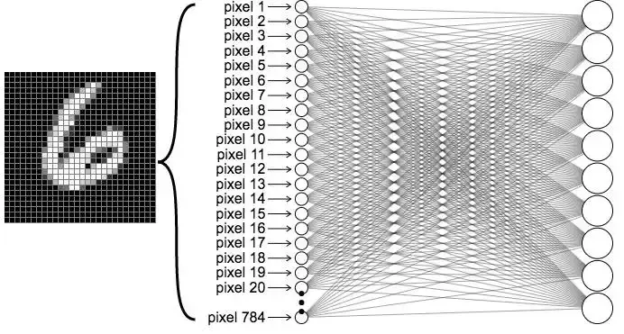
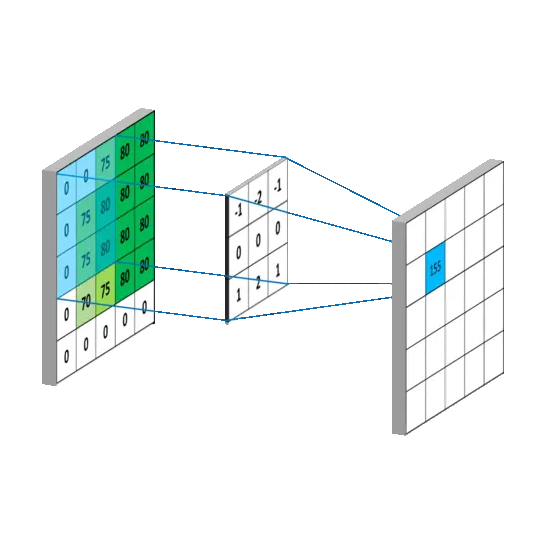

# Vision Transformer (ViT)

ViT的全称是**Vision Transformer**，是一种将自然语言处理中的Transformer架构应用于计算机视觉任务的模型。其核心思想是 ​**将图像分割为多个小块(patches, 类似于LLM中的token)，通过自注意力机制实现全局特征建模**​ ，突破了传统卷积神经网络（CNN）的局部感受野限制。

---

## ViT基础介绍
### 核心架构创新
1. ​**图像分块序列化**​  
    - 输入图像被分割为固定尺寸图块（如16×16像素），每个图块展平为1D向量
    - 线性投影层将图块向量转换为嵌入表示（patch embeddings）
    - 添加可学习的位置编码保留空间信息：`z₀ = [x_class; x_p¹E; ...; x_pᴺE] + Eₚₒₛ`

2. ​**Transformer编码机制**​  
    - 多头自注意力层（MSA）：`MSA(z) = Concat(head₁,...,headₕ)Wᴼ`
    - 层归一化（LayerNorm）和残差连接
    - MLP前馈网络（GeLU激活）

3. ​**与传统CNN的本质差异**​
   | 特性        | CNN                  | ViT                     |
   |-------------|----------------------|-------------------------|
   | 感受野      | 局部受限（卷积核）   | 全局（patch间自注意力机制）    |
   | 位置感知    | 平移不变性（内置）   | 需显式位置编码          |
   | 数据需求    | 中等规模有效         | 依赖大规模预训练  |

---

## 二、ViT实际效果

（数据来源于deepseek, 未实际测试与校验）

### 性能验证

| 任务类型       | 数据集         | ViT最佳模型       | 性能指标         | 对比CNN优势    |
|----------------|----------------|-------------------|------------------|---------------|
| 图像分类       | ImageNet-21K  | ViT-G/14 (20亿参数)| 90.45% Top-1 | +2.3%         |
| 目标检测       | COCO           | ViT-Backbone YOLO | 56.8 mAP    | +3.5 mAP      |
| 医学影像分割   | LVM-Med        | ViT-Hybrid        | 89.7% Dice系数| +7.2%        |
| 小样本学习     | ImageNet-10shot| ViT-B/16          | 84.86% Acc   | +12.6%        |

▶️ ​**关键结论**​：
- 数据规模>1亿时，ViT计算效率达CNN的**4倍**​（同等精度）
- 在视频分析中，Conv3D+ViT混合架构帧率推理提升**22 fps→35 fps**
- 工业缺陷检测场景，ViT对微小缺陷（<5像素）识别率比CNN高**18.3%​**

---

## 三、基础概念
### 1. 传统图像识别

学习图像识别, 第一个ai算法一般都是全连接网络识别 [MNIST](https://en.wikipedia.org/wiki/MNIST_database) 手写数字. MNIST 包含 60,000 张训练图像和 10,000 张测试图像，每张 28x28 像素的灰度手写数字（0-9），展平为 784 维向量输入全连接网络。网络结构包括输入层、隐藏层和输出层，最终输出概率分布, 如下图: 



实现示例:

```python
class Mnist_NN(nn.Module):
    def __init__(self):
        super().__init__()
        self.hidden1 = nn.Linear(784, 128)  # 参数量: 784×128 + 128 = 100,480
        self.hidden2 = nn.Linear(128, 256)  # 参数量: 128×256 + 256 = 33,024
        self.out = nn.Linear(256, 10)      # 参数量: 256×10 + 10 = 2,570

```

但参数数量庞大，对于高分辨率图像（如 1000x1000 像素, 输入直接变成了100w个点, 参数量直接破1亿）计算成本过高，促成了 CNN 的发展。

---

### 2. 卷积函数（Conv2D）

卷积(Convolution)是一种数学运算，核心思想是通过两个函数的相互作用生成第三个函数, 表征一个函数在另一个函数上的加权叠加效果. 对于图像识别的卷积来说, 直观理解便是: 卷积核在图像上滑动，计算局部像素的加权和，实现模糊、锐化或边缘检测, **可以视为滑动加权平均或局部特征提取​**


函数定义(pytorch):
```python
torch.nn.Conv2d(
    in_channels: int, 
    out_channels: int, 
    kernel_size: Union[int, Tuple[int, int]], 
    stride: Union[int, Tuple[int, int]] = 1, 
    padding: Union[int, Tuple[int, int]] = 0, 
    ...
)
```

##### 参数说明

- in_channels：输入数据的通道数(如RGB图像为3，灰度图为1)

- out_channels: 卷积核数量​（即**输出特征图的通道数**）

- kernel_size=(3,3)：卷积核尺寸（如3或(3,3)），决定局部感受野大小

- strides=2：过滤器的步幅为2,  也就是**下采样**. 使用后 H, W 均会变为 1/2, 也就是图的 像素 缩小4倍

- padding='same'：使用填充, 使输出大小与输入大小相同


**参数量:**
- 参数量由权重(weights)​和偏置(bias)​两部分组成: weights = kernel_size[0] × kernel_size[1] × in_channels × out_channels, 重点是**与图片输入大小无关**, 只运算
- **与fcn对比**: 对于 28\*28 的输入图片来说, 一次conv卷积的参数量大概在: 3\*3(卷积核)\*3(输入维度rgb)\*16(输出特征图维度) + 16(偏置) = 448, 即使多次conv2d, 参数量依然远小于 FCN(但运算量大很多)


**维度变化:** 
- H / W图片本身维度变化: 由strides决定, 如strides=2, 则 H'=H/2, W'=W/2
- **通道数(特征维度)**: 由out_channels决定, 其实就是一个卷积核得出一条通道, 那多个卷积核参与计算, 就能得到多个输出通道. 
- **升维降维**: 由上一条得知, 输出维度与输入维度无关, 只与卷积核个数(out_channels)有关, 因此可用于维度的转换(升维降维, 如MLP头或输出头等), 代替之前的全连接, 大幅减少参数的同时, 还能提升并行效率.


#### 工作流程

下图是一个 5\*5 的图片(第一张图, 值为其像素值, 通道数为1, 如果为多通道, 也是联合计算只输出一个值), 在卷积核大小为 3\*3(第二张图, 值为其参数) 的情况下, 一个卷积核的工作流程, 生成一个特征通道图(图3, 每个值为所有输入通道经过一个卷积核运算的结果). 如果有多个卷积核(out_channels), 则第三张图会有多个特征图.



##### 示例

```python
import torch
import torch.nn as nn

# 定义 Conv2D 层, 参数量 = 3*3*3*16 = 432
conv = nn.Conv2d(
    in_channels=3,     # 输入通道数（RGB图像为3）
    out_channels=16,   # 输出通道数（16个卷积核）
    kernel_size=3,     # 卷积核大小 3x3
    stride=2,          # 步长=2（下采样）
    padding=1          # 填充=1（保持输出尺寸）
)

input_tensor = torch.randn(1, 3, 32, 32)

# 卷积计算
output = conv(input_tensor)

print("输入尺寸:", input_tensor.shape)  # torch.Size([1, 3, 32, 32])
print("输出尺寸:", output.shape)        # torch.Size([1, 16, 16, 16])
```

---

### 3. 特征图(Feature Map)

从前面的 conv2d 函数可以看出, 特征图便是一张图片中某一块区域(如16*16px)整个特征的集合, 体现出来的便是 特征图向量值.

比如: 
- 输入图片为 640\*640px, 其向量表示为: [640, 640, 3] (3为rgb值)
- 经过一次 stride=2/kernel_size=(3,3)/out_channel=64 的conv2d之后, 会得到一个 [320, 320, 64] 的向量
- 那相当于对于原图来说, 每2\*2px的区域的值为[64]的向量, **这个 size=64的向量表示的便是这个区域的特征**

经过多次conv2d卷积后(多次提取特征, 并增大参数量以增强表示), 可以将不同的特征图直观理解为:
- ​低级特征​: 边缘/纹理(浅层卷积输出)
- 高级语义​: 物体部件/整体(深层卷积输出)

---

## 四、ViT实现细节

### Transformer运算对象

这个部分我认为是vit中最重要的, 也是与llm的核心差异, 参与vit中transformer运算的基础是 patches, 而llm的基础是token. 

- **token字典(文字)可以理解为人类对自然世界的高度概括**, 能够形容出所有的场景, 但图片目前没有这么一个 token 字典.
- **patches表示一个图片中每一个序列化的图块**, 如224\*224图像被分割为 196 个固定大小的图块, 如16\*16(像素)\*320(特征向量), 然后执行attention计算.

所以其实对于vit来说, 也是要经过下采样将输入维度降低为多个patches, 每个patches(一个图块)由特征图来代表其特征, 直观理解:
- 原始图为 224\*224, 最后被分割为 16\*16=196 个图块, 每个图块的特征向量值为 [320]
- 对于某个特征图向量, 320个向量值中的每一个都是经过了多层卷积计算得到(假设经过了8层conv2d, 每个卷积核为3\*3)
- 所以实际上参数量挺大(由conv2d次数决定, yolo中有大量的conv2d), 也就可以模拟或学习出足够的情景

### moat中的transformer实现

请参考 [moat实现](../others/moat.md) 与 [moat_block实现](../../common/moat_block.md)


### yolov12中的transformer实现

请参考 [yolov12实现](../yolo/yolov12.md)


## 五、ViT应用场景

综前所述, 我们能发现vit最大的优势便是: 能够收集局部区域与整体背景的相互关系(其实就是对比), 也就是擅长背景复杂, 尤其是位置确定的目标检测与切割(加上位置编码). 如下为想到的一些情景(尚未求证):

- **医学影像分析:** 由于医学影像背景一般不变化, 因此认为适合用transformer来做异常检测.

- **工业缺陷检测:** 对于一些背景复杂, 但是缺陷较小的场景, 适合使用vit来做检测, 如: PCB板焊点检测（<0.1mm²缺陷召回率92.3%​, 数据来源于网络）


## 六、对我们的启示

- vit 本质上还是基于特征图来做attention, 所以下采样对特征的丢失(如有)依然避免不了, 但如果是背景复杂或缺陷虽小但对比明显的情景, 则适合使用.

- moat 本质依然是基于特征图做attention, 随着输入图片的变大, 特征图也变大来支撑 高分辨率, 这和yolov12 的transformer没有本质区别(处于理论阶段, 下一步需代码级别测试分析)

- 针对yolov12的改进思路: 尝试将 area数 调大(强调局部感受野), 同时增加注意力block个数(类似于llm那种堆砌attention模块), 尝试优化小目标的检测能力

- 如果是背景纯净的偏光片, 认为可以尝试 对图片做上采样(如yolo默认输入为640\*640, 则我们切割图片为320\*320, 甚至160\*160打标记), 再做大特征图(160\*160, 相当于3\*3px像素降低了一倍区域)以尽量保留特征

- 此外可尝试 unet 那种 u 型结构, 尽量保留原始信息, 这个可以尝试直接基于yolo修改

