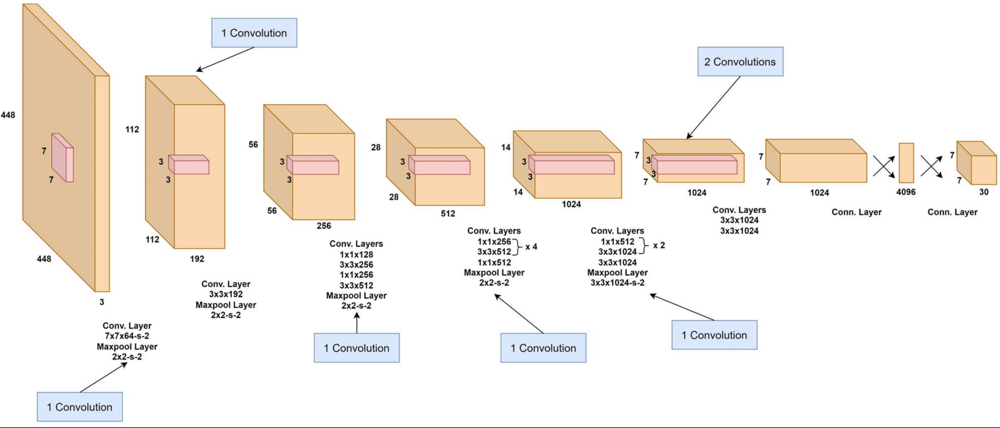

# YOLO

YOLO(You Only Look Once)是一种高效的单阶段目标检测算法.

## yolo网络架构

yolo网络架构主要包括: 
- **骨干网络(Backbone)**: 负责特征提取, 常用的如 yolov1-v3 的 darknet->darknet19->darknet53
- **颈部网络(Neck)**: 连接 backbone与检测头, 最终输出多尺度特征金字塔​(如13×13、26×26、52×52), 供检测头生成边界框和类别预测: 
    + yolov1无颈部网络, 只有全连接层, 所以如下yolov1架构图中体现不出来
    + 新版本引入颈部网络(多尺度融合), 可参考yolov8架构图
- **检测头(Detection Head)**: 负责生成最终预测结果, 将骨干网络(Backbone)提取的特征转换为具体的检测输出(如边界框坐标、类别概率等):
    + YOLOv1将图像划分为 7×7 的网格, 每个网格预测 2个边界框​与​20个类别概率, 因此大小为 2*5(classid, x, y, w, h) + 20 = 30, 也就是 (7, 7, 30)
    + YOLOv3通过引入FPN融合不同层特征, 取消全连接层, 输出13×13、26×26、52×52(而不只是7*7)三种尺度. 

### yolov1 架构图


### yolov8 架构图

[yolov8架构图](assets/yolov8_architecture.png)


### yolov1维度流转图(darknet架构)


## yolov3 源码分析
yolov3是yolo系列较为经典的一个版本, yolov4-v8的架构基本都沿袭自v3版本.
我们分析的代码来自这里: [yolov3-minimum-implementation](https://github.com/eriklindernoren/PyTorch-YOLOv3/tree/master), 不逐行分析, 更多是架构上的一些梳理.

### 初始化

```python
# 直接命名為 Darknet 了:)
class Darknet(nn.Module):
    """YOLOv3 object detection model"""

    def __init__(self, config_path):
        super(Darknet, self).__init__()

        # 读取配置文件(yolov3.cfg)中对应内容, 保存到module_defs中, 用于构建网络
        self.module_defs = parse_model_config(config_path)

        # create_modules函数根据解析的配置构建PyTorch模块
        # hyperparams: 存储网络全局参数（如输入尺寸、学习率)
        # module_list: 按顺序存储各层的PyTorch模块(如nn.Conv2d、YOLOLayer)
        self.hyperparams, self.module_list = create_modules(self.module_defs)

        # 筛选出所有YOLOLayer实例(即检测头), 用于后续计算损失和输出处理
        # YOLOv3通常有3个检测头(对应13×13、26×26、52×52特征图)
        # 日志显示为3个: [ YOLOLayer(
        #   (mse_loss): MSELoss()
        #   (bce_loss): BCELoss()
        # )
        self.yolo_layers = [layer[0]
                            for layer in self.module_list if isinstance(layer[0], YOLOLayer)]
        self.seen = 0

        # 初始化Darknet权重文件的头部信息, 加载预训练权重时会更新seen值
        # 格式为[major_version, minor_version, revision, seen, _]
        self.header_info = np.array([0, 0, 0, self.seen, 0], dtype=np.int32)
```

如上初始化代码中会使用到 [yolov3.cfg](assets/yolov3.cfg) 配置文件, 本质他是一个构建网络的设定, 定义了网络结构、训练参数和检测头设置, 主要分为以下部分:

##### 1. ​网络基础参数([net])

- 输入设置​: width=416, height=416, channels=3(输入图像尺寸需为32的倍数)
- 训练参数​: 如 batch=16, momentum=0.9(优化动量)、decay=0.0005(权重衰减)等


##### 骨干网络(Darknet-53)

这部分包含 convolutional, shortcut 等定义, 相当于按顺序定义网络.

- ​卷积层([convolutional]): 
    + 一共有 **75个 [convolutional]定义**(包括Darknet-53骨干网络和后续的多尺度检测头). 其中 Darknet-53骨干网络​包括:
        - 初始的7个独立卷积层(用于下采样和特征提取)
        - 后续的23个残差块(每个残差块包含2个卷积层：1个1×1卷积和1个3×3卷积), 共46个卷积层

    + 包含filters(输出通道数)、size(卷积核大小)、stride(步长)、activation(激活函数)等
    + 下采样通过stride=2的卷积实现(如[convolutional] stride=2)

- 残差连接([shortcut]):
    + Darknet-53部分包含23个残差块, 每个残差块包含1个shortcut层
    + from=-3表示与倒数第3层特征图相加, 类似ResNet结构


##### 3. ​多尺度检测头([yolo])

**一共有3个 [yolo] 设置, 分别对应13×13、26×26、52×52网格**, 检测不同尺寸目标, 每个yolo设置包含:

- ​锚框设置:
    + anchors定义9个预设框尺寸大小, mask指定当前尺度使用的锚框索引(如mask=6,7,8)
    + 小目标层​(高分辨率)使用较大的锚框(如116,90, 156,198, 373,326)
    + 通过mask分配不同尺度的锚框, 适配不同大小的目标检测

    + classes=80(COCO类别数)、num=9(锚框总数)

- 训练参数:
    + jitter=0.3(数据抖动增强)、ignore_thresh=0.7(IOU阈值过滤低质量预测)

```ini
# 第一个 yolo 配置
[yolo]
# mask的值表示从anchors列表中选择第7、8、9个锚框(索引从0开始), 即 116,90, 156,198, 373,326
mask = 6,7,8

# 格式为[w1,h1, w2,h2, ..., w9,h9], 表示一个框(常见物体)的 宽度与高度
# 这些尺寸通常通过K-means聚类在训练数据集上计算得到, 覆盖数据集中目标的常见宽高比
# 如果换数据集, 那在YOLOv5之后自动对数据集中的目标框进行K-means聚类, 生成新的锚框尺寸
anchors = 10,13,  16,30,  33,23,  30,61,  62,45,  59,119,  116,90,  156,198,  373,326
classes=80
num=9
jitter=.3
ignore_thresh = .7
truth_thresh = 1
random=1
```


##### 特征融合模块

- 路由层([route]): layers=-1, 61表示合并当前层和第61层的特征图(沿通道维度拼接)
- ​上采样([upsample]): stride=2通过插值放大特征图, 用于融合高分辨率特征


### Forward

```python

def forward(self, x):
    img_size = x.size(2)    # 获取输入图像高度/宽度(假设输入为正方形)
    layer_outputs, yolo_outputs = [], []    # 存储各层输出和YOLO检测头输出

    # 遍历配置文件定义的模块(module_defs)和对应的PyTorch模块(module_list)
    for i, (module_def, module) in enumerate(zip(self.module_defs, self.module_list)):
        
        # 常规层处理(卷积/上采样/池化), 直接前向forward传播即可
        if module_def["type"] in ["convolutional", "upsample", "maxpool"]:
            x = module(x)

        # 路由层(特征融合)
        # 拼接指定层的特征图(如layers=-1,-3表示当前层和倒数第3层)
        elif module_def["type"] == "route":
            # 拼接后的特征图combined_outputs, 形状为[batch, C, H, W](C是总通道数)
            combined_outputs = torch.cat([layer_outputs[int(layer_i)] for layer_i in module_def["layers"].split(",")], 1)

            # 将拼接后的特征图按通道均分为groups组, 每组独立处理(类似分组卷积的思想)
            # 在正常权重中推理1张图片(416, 416), 打印出来的如下日志为(有4个route与layer):

            # group_size: 512, group_id: 0, x.shape: torch.Size([1, 512, 13, 13])
            # group_size: 768, group_id: 0, x.shape: torch.Size([1, 768, 26, 26])
            # group_size: 256, group_id: 0, x.shape: torch.Size([1, 256, 26, 26])
            # group_size: 384, group_id: 0, x.shape: torch.Size([1, 384, 52, 52])

            # 关于只有3个yololayer但这里有4个route的问题, 是因为yolov4引入了SPP模块的特殊结构
            # 不细究
            group_size = combined_outputs.shape[1] // int(module_def.get("groups", 1))
            group_id = int(module_def.get("group_id", 0))
            x = combined_outputs[:, group_size * group_id : group_size * (group_id + 1)] 
        
        # 残差连接
        elif module_def["type"] == "shortcut":
            layer_i = int(module_def["from"])
            x = layer_outputs[-1] + layer_outputs[layer_i]

        # ​YOLO检测头
        elif module_def["type"] == "yolo":
            # 执行目标框检测, 分别对应不同的yolo头, module[0]无意义, 其实该数组只有一个值
            # 所以本质还是相当于3个yolo头顺序计算
            x = module[0](x, img_size)
            yolo_outputs.append(x)

        layer_outputs.append(x)

    # 输出处理
    return yolo_outputs if self.training else torch.cat(yolo_outputs, 1)
```

### YOLOLayer 解析

yololayer是yolo检测头.

```python

class YOLOLayer(nn.Module):
    """Detection layer"""

    def __init__(self, anchors: List[Tuple[int, int]], num_classes: int, new_coords: bool):
        super(YOLOLayer, self).__init__()

        self.num_anchors = len(anchors) # 记录当前层使用的锚框数量(通常为3)
        self.num_classes = num_classes  # 存储类别数, 通常为80
        self.new_coords = new_coords
        self.mse_loss = nn.MSELoss()    # 用于边界框坐标回归
        self.bce_loss = nn.BCELoss()    # 用于目标置信度和类别概率的二分类计算
        self.no = num_classes + 5       # 每个锚框的输出维度(4+1+num_classes) = 85
        self.grid = torch.zeros(1)  # TODO

        # 将锚框列表(如[(10,13), (16,30)])转换为PyTorch张量, 形状为(num_anchors, 2)
        anchors = torch.tensor(list(chain(*anchors))).float().view(-1, 2)
        self.register_buffer('anchors', anchors)
        self.register_buffer(
            'anchor_grid', anchors.clone().view(1, -1, 1, 1, 2))
        self.stride = None

    def forward(self, x: torch.Tensor, img_size: int) -> torch.Tensor:
        # 调整实际步长, 根据输入图像尺寸和特征图大小动态计算, 用于恢复图像
        stride = img_size // x.size(2)
        self.stride = stride

        # 255对应3*(5+80) (3个锚框, 每个预测5个参数+80类概率)
        bs, _, ny, nx = x.shape  # x(bs,255,20,20) to x(bs,3,20,20,85)
        x = x.view(bs, self.num_anchors, self.no, ny, nx).permute(0, 1, 3, 4, 2).contiguous()

        if not self.training:  # inference
            if self.grid.shape[2:4] != x.shape[2:4]:
                self.grid = self._make_grid(nx, ny).to(x.device)

            # 将图还原, 从x(相对位置或比例)还原为原图实际像素位置与大小
            # 比例坐标乘以原图尺寸 = 像素坐标
            if self.new_coords:
                x[..., 0:2] = (x[..., 0:2] + self.grid) * stride  # xy
                x[..., 2:4] = x[..., 2:4] ** 2 * (4 * self.anchor_grid) # wh
            else:
                x[..., 0:2] = (x[..., 0:2].sigmoid() + self.grid) * stride  # xy
                x[..., 2:4] = torch.exp(x[..., 2:4]) * self.anchor_grid # wh
                x[..., 4:] = x[..., 4:].sigmoid() # conf, cls
            x = x.view(bs, -1, self.no)

        # 如果是训练模式, 则继续返回比例图, 方便继续训练
        return x
```


### 运行日志

一些运行日志结果记录与分析, 其中输出维度 [1, 10647, 85] 是YOLOv3在所有尺度特征图上预测的边界框总数, 由三部分组成:
- ​13×13网格​: 每个网格预测3个框, 13×13×3=507
- ​26×26网格​: 26×26×3=2028
- ​52×52网格​: 52×52×3=8112

所以, 总计: 507+2028+8112=10647 个预测框(多尺度检测策略)

每个预测框包含85个参数:
- **前4个值**​: 边界框坐标 (x,y,w,h), 其中(x,y) 为中心点相对网格的偏移量, (w,h) 为宽高(相对于先验框的缩放比例)
- **第5个值​**: 目标置信度(objectness score), 表示框内存在目标的概率
- **后80个值**​: COCO数据集的80个类别概率(需要取最大概率的类别)

最后得出 label(如dog | Confidence: 0.9924)的过程:
- 过滤掉置信度低于阈值(如0.5)的框
- 对剩余框执行非极大值抑制(NMS)去除冗余框
- 取最高概率的类别作为最终标签

```bash

# 运行detect检测, weights是标准版本 237M, test目录有1张带有dog的图片
# 由于版本较老, 且使用poetry, 因此修改了代码, 去掉了所有gpu逻辑之后可正常运行
poetry run yolo-detect --images data/test/

# 如下为输出日志:
detections.shape: torch.Size([1, 10647, 85])
Image data/test/dog.jpg:
        + Label: bicycle | Confidence: 0.9929
        + Label: dog | Confidence: 0.9924
        + Label: truck | Confidence: 0.9401
---- Detections were saved to: 'output' ----
```


## 参考
- [yolov1-v12介绍](https://learnopencv.com/mastering-all-yolo-models/#yolov1)