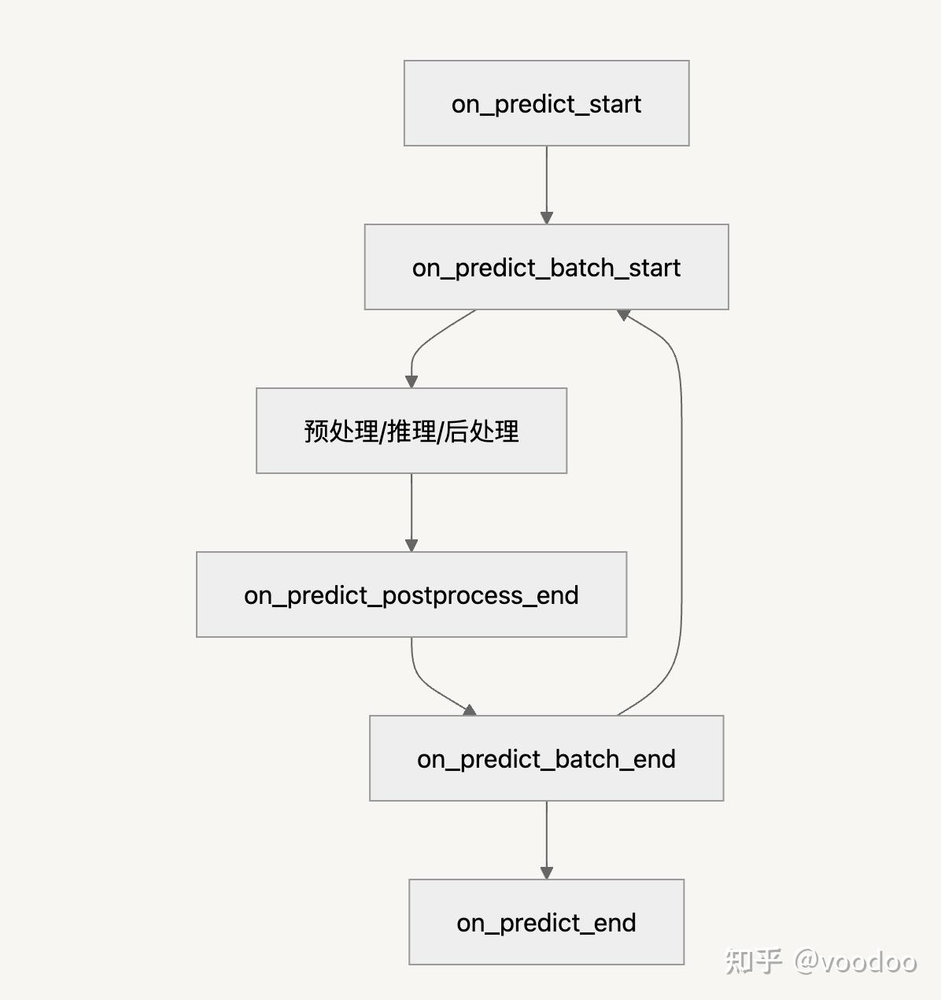

# YOLO V12 源码分析

YOLO12 引入了一种以注意力为中心的架构, 它不同于以往 YOLO 模型中使用的基于 CNN 的传统方法, 但仍保持了许多应用所必需的实时推理速度. 该模型通过对注意力机制和整体网络架构进行新颖的方法创新, 实现了最先进的物体检测精度, 同时保持了实时性能.

## YOLO12 改进点

- **区域注意机制：** 一种新的自我注意方法, 能有效处理大的感受野. 它可将特征图横向或纵向划分为 x 个大小相等的区域(默认为 4 个), 从而避免复杂的操作, 并保持较大的有效感受野. 与标准自注意相比, 这大大降低了计算成本

- **优化注意力架构:** 简化了标准关注机制, 以提高效率并与YOLO框架兼容. 这包括:
    + 使用 FlashAttention 尽量减少内存访问开销
    + 去除位置编码, 使模型更简洁、更快速
    + 调整 MLP 比例(从通常的 4 调整为 1.2 或 2), 以更好地平衡注意力层和前馈层之间的计算
    + 减少堆叠区块的深度, 提高优化效果
    + 酌情利用卷积运算, 提高计算效率
    + 在注意力机制中加入 7x7 可分离卷积(位置感知器), 对位置信息进行隐式编码

- **...**

---


## ultralytics 目录架构

#### cfg 目录
- ​**功能**​：存放所有配置文件
- 子目录：
  - `datasets/`：数据集路径与类别定义（如 `coco.yaml`）
  - `models/`：模型架构定义（如 `yolov8n.yaml`）
  - `trackers/`：目标跟踪算法配置（如 `botsort.yaml`）
- 关键文件：
  - `default.yaml`：全局默认参数


#### data 目录
- ​**功能**​：数据集加载与预处理
- 核心文件：
  - `dataset.py`：基础数据集类
  - `augmentations.py`：图像增强逻辑

#### engine 目录(核心逻辑)
- ​**功能**​：训练/验证/预测流程控制
- 关键模块：
  - `model.py`：主model类, 模型总入口
  - `predictor.py`：预测类
  - `trainer.py`：训练主循环
  - `validator.py`：模型验证(计算 mAP、精度指标)

#### models 目录
- ​**功能**​：模型定义与推理接口
- 核心内容：
  - `yolo/`：YOLO 系列模型实现
  - `export.py`：导出兼容层

#### nn 目录
- ​**功能**​：神经网络底层模块
- 关键文件：
  - `modules.py`：自定义网络层
  - `tasks.py`：多任务头部设计

#### solutions 目录
- ​**功能**​：高级应用解决方案
- 示例：
  - `object_counter.py`：目标计数
  - `heatmap.py`：密度热力图生成

#### trackers 目录
- ​**功能**​：多目标跟踪算法
- 包含内容：
  - `botsort.yaml`：算法配置
  - `track.py`：跟踪器基类


---

## yolov12的transformer实现

yolov12中使用 A2C2f 模块来实现注意力, 且在backbone与head中均多次使用.

### 相关配置文件

先查看yolo配置文件:

```ini
# YOLO12-turbo backbone
backbone:
  # [from, repeats, module, args]
  - [-1, 1, Conv,  [64, 3, 2]] # 0-P1/2
# - ...

  - [-1, 1, Conv,  [512, 3, 2]] # 5-P4/16
  
  # P4/16: 即输入图像下采样16倍后的特征图
  # 512: 输出通道数; True: 表示启用残差连接; 4: 区域注意力划分数(area)
  - [-1, 4, A2C2f, [512, True, 4]]

  - [-1, 1, Conv,  [1024, 3, 2]] # 7-P5/32

  # P5/32: 下采样32倍后的特征图
  - [-1, 4, A2C2f, [1024, True, 1]] # 8

# YOLO12-turbo head
head:
  - [-1, 1, nn.Upsample, [None, 2, "nearest"]]
  - [[-1, 6], 1, Concat, [1]] # cat backbone P4

  # 整合高层语义(P5)和底层细节(P4), 优化中等尺度目标的检测
  - [-1, 2, A2C2f, [512, False, -1]] # 11

  - [-1, 1, nn.Upsample, [None, 2, "nearest"]]
  - [[-1, 4], 1, Concat, [1]] # cat backbone P3

  # P3特征包含更多细节信息, 区域注意力帮助定位微小目标(如人脸表情、工业缺陷)
  - [-1, 2, A2C2f, [256, False, -1]] # 14

  - [-1, 1, Conv, [256, 3, 2]]
  - [[-1, 11], 1, Concat, [1]] # cat head P4

  # 对第14层输出与第11层输出的拼接后的输出做注意力调整
  - [-1, 2, A2C2f, [512, False, -1]] # 17

# - ...

  - [[14, 17, 20], 1, Detect, [nc]] # Detect(P3, P4, P5)
```

### A2C2f 实现

一些核心的init参数:
- ​**c1**: 输入通道数（如Backbone中P4层的256维）
- **c2**: 输出通道数（如512或1024），决定特征图的维度
- ​**n**: 堆叠的ABlock或C3k模块数量（默认为1）
- ​**area**: 区域划分数（如4表示水平/垂直4分区），控制注意力计算范围

```python
class A2C2f(nn.Module): 
    def __init__(self, c1, c2, n=1, a2=True, area=1, residual=False, mlp_ratio=2.0, e=0.5, g=1, shortcut=True):
        # 用来降低维度, 减少计算量
        c_ = int(c2 * e)  # hidden channels

        # 多注意头数目, 与llm中一致
        num_heads = c_ // 32

        # 1×1卷积将输入从c1降至c_, 减少后续计算量
        self.cv1 = Conv(c1, c_, 1, 1)

        # 拼接n个ABlock输出后，1×1卷积恢复至目标维度c2
        self.cv2 = Conv((1 + n) * c_, c2, 1)

        init_values = 0.01
        self.gamma = nn.Parameter(init_values * torch.ones((c2)), requires_grad=True) if a2 and residual else None

        # 初始化 n 个ABBlock块
        self.m = nn.ModuleList(
            nn.Sequential(*(ABlock(c_, num_heads, mlp_ratio, area) for _ in range(2))) if a2 else C3k(c_, c_, 2, shortcut, g) for _ in range(n)
        )
```

对于某一个 ABBlock 块的定义:

```python
class ABlock(nn.Module):
    def __init__(self, dim, num_heads, mlp_ratio=1.2, area=1):
        self.attn = AAttn(dim, num_heads=num_heads, area=area)
        mlp_hidden_dim = int(dim * mlp_ratio)
        self.mlp = nn.Sequential(Conv(dim, mlp_hidden_dim, 1), Conv(mlp_hidden_dim, dim, 1, act=False))

    def forward(self, x):
        x = x + self.attn(x)
        x = x + self.mlp(x)
        return x
```

从上可以看出, 与llm中的定义类似, 但是这里yolo做了一个优化, 便是他提出了area区域注意力:
- 如果area=4, **则会将输入特征图(都是基于特征图做注意力计算)分为4块, 在每一个块里面做attention计算, 相当于每个区域独立不产生关系**, 减少计算量
- 实际上, 对于小目标检测来说, 这个分区域甚至可以调整更大, 以减少计算量, 因为很多小目标与其他远距离区域关系不大
- 具体计算逻辑与llm中基本一致

```python
class AAttn(nn.Module):
    def forward(self, x):
        # 输入x的形状: [Batch, Channels, Height, Width]
        B, C, H, W = x.shape
        N = H * W

        # 通过qk卷积生成Q+K, 展平空间维度并转置为[B, N, 2C]
        # qk卷积同时生成查询（Q）和键（K），通过拼接减少计算量
        qk = self.qk(x).flatten(2).transpose(1, 2)
        v = self.v(x)   # 通过v卷积生成V, 形状保持[B, C, H, W]
        pp = self.pe(v) # 位置编码(如sin-cos或可学习编码), 形状与v相同
        v = v.flatten(2).transpose(1, 2)

        # 按区域划分QK: [B*area, N/area, 2C]
        if self.area > 1:
            qk = qk.reshape(B * self.area, N // self.area, C * 2)
            v = v.reshape(B * self.area, N // self.area, C)
            B, N, _ = qk.shape
        q, k = qk.split([C, C], dim=2)

        # ...
        else:
            # 计算注意力
            q = q.transpose(1, 2).view(B, self.num_heads, self.head_dim, N)
            k = k.transpose(1, 2).view(B, self.num_heads, self.head_dim, N)
            v = v.transpose(1, 2).view(B, self.num_heads, self.head_dim, N)

            attn = (q.transpose(-2, -1) @ k) * (self.head_dim ** -0.5)
            max_attn = attn.max(dim=-1, keepdim=True).values
            exp_attn = torch.exp(attn - max_attn)
            attn = exp_attn / exp_attn.sum(dim=-1, keepdim=True)
            x = (v @ attn.transpose(-2, -1))

            x = x.permute(0, 3, 1, 2)

        if self.area > 1:
            x = x.reshape(B // self.area, N * self.area, C)
            B, N, _ = x.shape
        x = x.reshape(B, H, W, C).permute(0, 3, 1, 2)

        return self.proj(x + pp)
```

---

## ultralytics 框架

调试 ultralytics 代码, 勾勒 ultralytics 整个逻辑与框架.


### Engine 目录

#### Model类

Model类是 YOLO 父类, 主要是对不同的yolo版本(如yolov3/yolov12等)封装处理, 提供对外的统一接口, 如 predict\train 等, 路径: yolov12\ultralytics\engine\model.py.


```python
class Model(nn.Module, PyTorchModelHubMixin, repo_url="https://github.com/ultralytics/ultralytics", pipeline_tag="object-detection", license="agpl-3.0"):
    """
    A base class for implementing YOLO models, unifying APIs across different model types.
    ...
    """

    # 初始化一个 Module, 根据传入的 model(如 yolo11n.pt)自动下载对应yolo版本的权重文件
    # 优先本地读取(如有); 同时初始化对应的yolo版本代码
    def __init__(
        self,
        model: Union[str, Path] = "yolo11n.pt",
        task: str = None,
        verbose: bool = False,
    ) -> None:

    # ...

    if Path(model).suffix in {".yaml", ".yml"}:
        # 如果使用 yolo配置文件, 则new一个新对象, 需要自己从0开始学习
        # 注意: yolo的模型都是通过配置文件来设置各个子网络
        # 可参考: yolov12\ultralytics\cfg\models\v12\yolov12.yaml
        self._new(model, task=task, verbose=verbose)
    else:
        # load预训练权重模型, 如果本地不存在, 则自动去官方服务器下载
        self._load(model, task=task)
```

在初始化函数中, 会调用 _load 函数:

```python
def _load(self, weights: str, task=None) -> None:
    # ... 预处理

    if Path(weights).suffix == ".pt":
        # 下载与解析预训练权重文件
        self.model, self.ckpt = attempt_load_one_weight(weights)

        self.task = self.model.args["task"]
        self.overrides = self.model.args = self._reset_ckpt_args(self.model.args)
        self.ckpt_path = self.model.pt_path


# path: yolov12\ultralytics\nn\tasks.py
def attempt_load_one_weight(weight, device=None, inplace=True, fuse=False):
    # 安全加载 PyTorch 检查点文件, 返回:
    # ckpt: 包含模型权重、训练参数等的字典; weight: 权重文件的路径
    ckpt, weight = torch_safe_load(weight)

    # 加载模型权重, 若检查点包含指数移动平均模型权重(ckpt["ema"]), 则优先加载;
    # 否则加载原始模型(ckpt["model"])
    model = (ckpt.get("ema") or ckpt["model"]).to(device).float()

    # 其他处理...

    return model, ckpt


def torch_safe_load(weight, safe_only=False):
    # 省略非核心代码

    # 下载文件
    file = attempt_download_asset(weight)

    # 加载ckpt
    ckpt = torch.load(file, map_location="cpu")

    return ckpt, file

# path: yolov12\ultralytics\utils\downloads.py
def attempt_download_asset(file, repo="ultralytics/assets", release="v8.3.0", **kwargs):
    # ...

    # 如果本地存在, 直接加载本地文件或文件夹
    if file.exists():
        return str(file)
    elif (SETTINGS["weights_dir"] / file).exists():
        return str(SETTINGS["weights_dir"] / file)

    # 否则去官方路径下载预训练权重与模型
    else:
        # 提供了路径, 直接下载
        if str(file).startswith(("http:/", "https:/")):  # download
            # ...
        elif repo == GITHUB_ASSETS_REPO and name in GITHUB_ASSETS_NAMES:
            # 正常的 yolo版本, 如yolov11版本
            safe_download(url=f"{download_url}/{release}/{name}", file=file, min_bytes=1e5, **kwargs)
        else:
            # 其他版本, 如yolov12版本
            tag, assets = get_github_assets(repo, release)
            if not assets:
                tag, assets = get_github_assets(repo)  # latest release
            if name in assets:
                safe_download(url=f"{download_url}/{tag}/{name}", file=file, min_bytes=1e5, **kwargs)

    return str(file)
```

---

#### Predict 封装

**predict** 参数:
- ​**source**​：输入源，支持多种格式（文件路径、图像对象、张量等）
- ​**stream**​：流模式标志，适用于实时视频或摄像头输入
- ​**predictor**​：自定义预测器实例，若为 None 则使用默认预测器
- **kwargs**​：覆盖预测配置（如 conf=0.25、imgsz=640）

实际上, model的真正初始化实在本函数的 setup_model 实现的, **setup_model函数 是 YOLO 模型初始化的实际执行者**:

```python
def predict(
        self,
        source: Union[str, Path, int, Image.Image, list, tuple, np.ndarray, torch.Tensor] = None,
        stream: bool = False,
        predictor=None,
        **kwargs: Any,
    ) -> List[Results]:

    # 预处理等...

    # 首次调用​：初始化预测器，加载模型并配置参数
    if not self.predictor:
        # 这里通过 _smart_load 初始化 predictor 模块
        self.predictor = (predictor or self._smart_load("predictor"))(overrides=args, _callbacks=self.callbacks)

        # 初始化 predictor 模块
        self.predictor.setup_model(model=self.model, verbose=is_cli)

    # ​后续调用​：仅更新参数（如 conf、imgsz）和保存路径
    else:
        self.predictor.args = get_cfg(self.predictor.args, args)  # 更新参数
        if "project" in args or "name" in args:
            self.predictor.save_dir = get_save_dir(self.predictor.args)  # 更新保存路径


    # 一些省略逻辑..

    # ​CLI 模式​: 调用 predict_cli() 处理命令行输入。
    # ​非 CLI 模式​: 直接调用预测器，支持流式输入
    return self.predictor.predict_cli(source=source) if is_cli else self.predictor(source=source, stream=stream)
```

这里核心是创建了 self.predictor. 他通过 task_map 这个虚函数由子类实现, 这里就是由 yolo实现:
```python
# path: yolov12\ultralytics\models\yolo\model.py
def task_map(self):
    """Map head to model, validator, and predictor classes."""
    return {
        "detect": {
            "model": WorldModel,
            "validator": yolo.detect.DetectionValidator,
            "predictor": yolo.detect.DetectionPredictor,
            "trainer": yolo.world.WorldTrainer,
        }
    }

# DetectionPredictor 的定义如下(path: yolov12\ultralytics\models\yolo\detect\predict.py)
class DetectionPredictor(BasePredictor):
    def postprocess(self, preds, img, orig_imgs):
        """Post-processes predictions and returns a list of Results objects."""
        preds = ops.non_max_suppression(
            preds,
            self.args.conf,
            self.args.iou,
            agnostic=self.args.agnostic_nms,
            max_det=self.args.max_det,
            classes=self.args.classes,
        )

        if not isinstance(orig_imgs, list):  # input images are a torch.Tensor, not a list
            orig_imgs = ops.convert_torch2numpy_batch(orig_imgs)

        results = []
        for pred, orig_img, img_path in zip(preds, orig_imgs, self.batch[0]):
            pred[:, :4] = ops.scale_boxes(img.shape[2:], pred[:, :4], orig_img.shape)
            results.append(Results(orig_img, path=img_path, names=self.model.names, boxes=pred))
        return results
```

从上面可知, yolo的predict只实现了 一个 postprocess函数, 其他一些定义(未定义则调用父类对应函数)均由父类 **BasePredictor** 实现.


```python
# path: yolov12\ultralytics\engine\predictor.py
class BasePredictor:
    # 将输入图像(NumPy数组或Tensor)转换为模型可处理的格式
    # 如: 对输入图像列表进行LetterBox缩放(保持长宽比并填充边) 等
    def preprocess(self, im):
        # ...

    # 执行模型前向传播, 返回预测结果, 参数介绍:
    # augment：是否启用多尺度/翻转增强。
    # visualize：是否保存特征图可视化结果。
    # embed：是否返回嵌入向量（如特征提取任务）。
    def inference(self, im, *args, **kwargs):
        # ...

        return self.model(im, augment=self.args.augment, visualize=visualize, embed=self.args.embed, *args, **kwargs)

    # 对模型输出进行后处理(如NMS过滤重叠框), 当前为空实现
    def postprocess(self, preds, img, orig_imgs):
        # 父类只是空实现, 具体由子类实现
        return preds

    # 流式推理核心方法, 支持实时视频或摄像头输入
    def stream_inference(self, source=None, model=None, *args, **kwargs):
        # 1. 初始化模型和输入源(setup_model和setup_source)
        # 2. 预热模型(warmup)提升推理速度
        # 3. 循环处理每帧数据: 预处理→推理→后处理→结果保存/显示

    # 加载模型权重(支持.pt或.yaml), 初始化设备(CPU/GPU)和精度(FP16/FP32)
    # 真正的model初始化在这里!!
    def setup_model(self, model, verbose=True):
        self.model = AutoBackend(
            weights=model or self.args.model,
            device=select_device(self.args.device, verbose=verbose),
            dnn=self.args.dnn,
            data=self.args.data,
            fp16=self.args.half,
            batch=self.args.batch,
            fuse=True,
            verbose=verbose,
        )

        self.device = self.model.device  # update device
        self.args.half = self.model.fp16  # update half
        self.model.eval()


    # 其他辅助函数等....
```


而model的真正初始化便是在这个 **基类中的 setup_model 函数实现, 调用 self.model = AutoBackend... 实现**. AutoBackend 类是 Ultralytics YOLO 模型中的一个核心模块, 主要用于动态选择和管理不同格式的模型推理后端, 以实现跨框架、跨平台的模型部署和推理.

```python
# AutoBackend 类通过统一的接口封装了多种深度学习框架的模型加载和推理逻辑
# 支持包括 PyTorch、ONNX、TensorFlow 等在内的 12 种模型格式(如 .pt、.onnx、.engine 等)
# 用户只需提供模型文件路径, 该类会自动识别格式并选择对应的后端引擎进行推理

class AutoBackend(nn.Module):
    def __init__(...):
        if nn_module:
            # 处理逻辑
            # ...
            
        # PyTorch
        elif pt:
            model = attempt_load_weights(
                weights if isinstance(weights, list) else w, device=device, inplace=True, fuse=fuse
            )
            if hasattr(model, "kpt_shape"):
                kpt_shape = model.kpt_shape  # pose-only
            stride = max(int(model.stride.max()), 32)  # model stride
            names = model.module.names if hasattr(model, "module") else model.names  # get class names
            model.half() if fp16 else model.float()
            self.model = model

        # 其他格式识别与加载, 避免了开发者手动适配不同框架的繁琐工作
        # 例如 PyTorch 模型直接调用原生接口; ONNX 模型通过 ONNX Runtime 或 OpenCV DNN 加载; 
        # TensorRT 模型则使用其专用 API
        elif xxx...

    # forward函数
    def forward(self, im, augment=False, visualize=False, embed=None):
        b, ch, h, w = im.shape  # batch, channel, height, width
        if self.fp16 and im.dtype != torch.float16:
            im = im.half()  # to FP16
        if self.nhwc:
            im = im.permute(0, 2, 3, 1)  # torch BCHW to numpy BHWC shape(1,320,192,3)

        # PyTorch
        if self.pt or self.nn_module:
            y = self.model(im, augment=augment, visualize=visualize, embed=embed)

        # TorchScript
        elif self.jit:
            y = self.model(im)

        # 其他格式的forward处理
        elif xxx:
            # ...
```

Model与 Predict 分离的优势:
- 关注点分离: 将预测逻辑从主模型类中抽离
- 灵活性: 可以轻松替换或修改 predictor 而不影响其他功能
- 可扩展性: 能够为不同任务创建专门的 predictor

--- 


#### Train 封装

todo


### Callbacks 机制

#### Callbacks 初始化

```python
class BasePredictor:
    def __init__(self, **kwargs):
        # 从 Model 类传入的 callbacks
        self.callbacks = _callbacks or callbacks.get_default_callbacks()


default_callbacks = {
    # Run in trainer
    "on_pretrain_routine_start": [on_pretrain_routine_start],
    "on_pretrain_routine_end": [on_pretrain_routine_end],
    "on_train_start": [on_train_start],
    "on_train_epoch_start": [on_train_epoch_start],
    "on_train_batch_start": [on_train_batch_start],
    
    #...
```

#### Callbacks 的触发点

如predict触发点:
```python
def stream_inference(self, source=None, model=None, *args, **kwargs):
    # 预测开始时触发
    self.run_callbacks("on_predict_start")

    for self.batch in self.dataset:
        # 每个 batch 开始时触发
        self.run_callbacks("on_predict_batch_start")

        # ... 预处理、推理、后处理 ...

        # 后处理结束时触发
        self.run_callbacks("on_predict_postprocess_end")

        # batch 结束时触发
        self.run_callbacks("on_predict_batch_end")

    # 预测结束时触发
    self.run_callbacks("on_predict_end")
```

以及训练时的触发点:
```python
def _do_train(self, world_size=1):
    # train start 时触发
    self.run_callbacks("on_train_start")

    # ...

    while True:
        self.epoch = epoch

        # 每个epoch时触发
        self.run_callbacks("on_train_epoch_start")
        
        #...
```


#### Callback 执行方法
```python
def run_callbacks(self, event: str):
    """运行指定事件的所有回调函数"""
    for callback in self.callbacks.get(event, []):
        callback(self)
```

#### 典型事件流程




---


## 引用
1. [source code](https://github.com/sunsmarterjie/yolov12)
2. [ultralytics教程](https://docs.ultralytics.com/zh/models/yolo12/)
3. [ultralytics架构解析](https://zhuanlan.zhihu.com/p/14337636927)
4. [ultralytics目录结构分析](https://blog.csdn.net/java1314777/article/details/134824995)