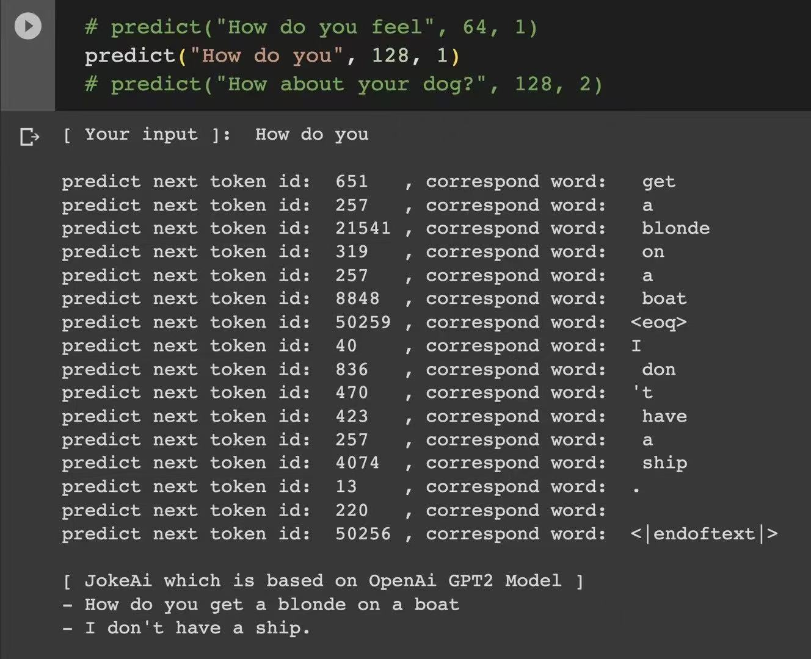
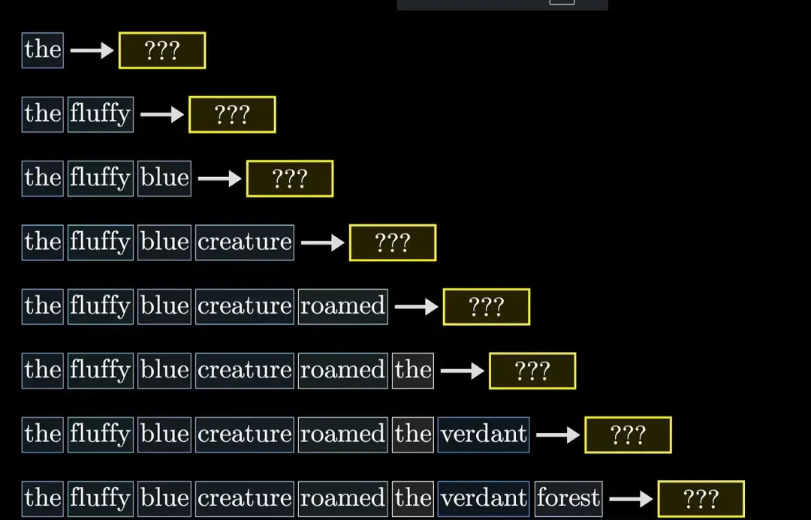
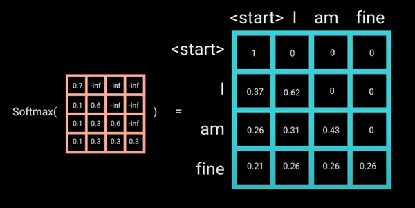
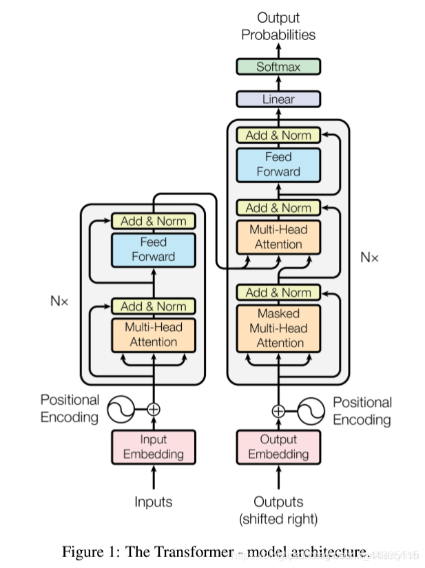
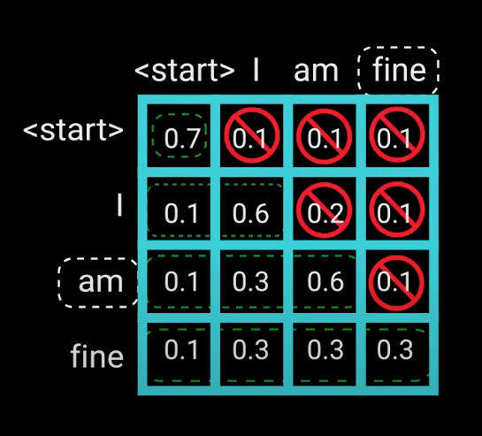

# Transformer

## 概述
其实可以把transformer理解成如下几个概要:
- vob字典里每个token都有一个特征向量(如768/1024), 基本代表了这个单词如 love 的特征. token是有限的, 可以完整的计算出彼此之间的关系度. 这是llm与cv最大的区别.
- pos位置里则是记录某个位置常见的特征向量(长度同上, 如768/1024), 表示这个位置如 第一个位置一般为 主语
- 而 attention自注意力 则表示 tok_emb+pos_emb 生成特征向量后的关系(q k v shape都是768*768), 也就是可以理解为: sequence序列里 每个单词之间的相互关系学习

供学习的代码可参考: [myGPT实现](https://github.com/leafan/myGPT)

---

## 形象理解

### chatGPT 如何做预测的

我们使用 deepseek或grok 的时候, 经常发现他们的回复是一小节一小节的输出, 就像人说话一样, 一个字一个字的说出来. 这不是故意模仿人类的行为, 而是他的机制就是一个字一个字的输出的.

下图是使用openai的 [chatgpt2](https://github.com/openai/gpt-2) 的预训练模型, 再下载了约6万行英文笑话集进行多次训练后, 执行预测的结果: 

所以, 实际上 chatgpt2 的输出特征为:
- 通过用户的输入, 运行模型, 输出第一个概率最大的字符(nms做概率筛选)
- 再把 用户的输入+输出的第一个字符 作为输入进行预测, 再输出第二个字符, 如此循环
- 实际环境可能有一些优化, 比如一次多预测几个字符或采用moe等, 但基础行为还是这套理论

直观理解:



### transformer到底干了啥(直观理解, 但不一定准确)

在一次attention计算中, 本质便是更新 input 之间的彼此关系. 比如输入 "I am fine", 在先不考虑位置信息(position_embedding)的情况下, 对于每一个 word, 如 "I", 会计算一遍 点积, 计算 "I" 与 "I", "am" "fine"这三个 word 之间的关系(注意每个单词如"I", 是一个高维矩阵, 他还带有特征向量等信息), 或者说: **更新 "I" 与句子中每个单子含义之间的关系和价值信息**, 如下图:



这种方法, 可以在一个超长句子中发挥优势, 而且最关键的是一举突破了时序序列的屏障. Transformer **更在意一个单词跟句子中每个单词的价值权重, 或者说每个token(对于图片来说, 就是一块区域的像素集合)之间的相互关系**, 非常适合处理语义复杂(llm)和背景复杂(vit)等情景.

如果直观的理解, transfomer就是记录了相互关系, **通过学习让有关系的二者计算出来权重更高(如 am 与 fine), 关系不大的权重低(如 am 与 end)**.

---

## Transformer 代码实现



Transformer分为Encoder和Decoder, 这个设计源于其最初的应用场景（如机器翻译）对双向上下文理解和自回归生成的双重需求, 如下代码分析基于 ChatGPT2, 他只包含Decoder, 是因为其任务（文本生成）仅依赖单向自回归生成.

### Input Embedding + Positional Encoding
对应图中左下角的 Inputs与Positional Encoding 转换

1. 首先将输入token串转换成token位置嵌入矩阵
2. 然后 升维至 [token length(1024)][embeded layer], 将位置编码对应的特征信息[embeded]引入


### 自注意力(Multi-Head Attention)实现

对应图中的 Multi-Head Attention部分.

具体逻辑请查看代码与注释， 基本就是论文中关于自注意力的一个代码实现. 其中命名为 causal, 是因为训练的时候, 比如预测第 n 个word的时候, 不能知道与 n+1 个word的关系, 如下图: 



```python

class CausalSelfAttention(nn.Module):
    def forward(self, x):
        B, T, C = x.size() # batch size, sequence length, embedding dimensionality (n_embd)

        # ​PyTorch的nn.Linear规则​：nn.Linear(in_features, out_features)
        # 的权重矩阵形状为(out_features,in_features)
        # 因此，当定义nn.Linear(C, 3C)时, 权重矩阵W的形状为(3C,C)

        # 把输入经过线性层得到的矩阵切分，得到qkv三个矩阵, c_attn的定义:
        # self.c_attn = nn.Linear(config.n_embd, 3 * config.n_embd, bias=config.bias)
        # 相当于 c_attn 便是 qkv本身的权重矩阵, 在这里运算后, 将x也一起相乘计算好了

        #    Q = X * W_Q  # [B,T,C] @ [C,d_k] => [B,T,d_k]
        #    K = X * W_K  # [B,T,C] @ [C,d_k] => [B,T,d_k]
        #    V = X * W_V  # [B,T,C] @ [C,d_v] => [B,T,d_v]

        # W是形状为(C,C)的权重矩阵, WT是其转置, 形状(C,C)
        q, k, v  = self.c_attn(x).split(self.n_embd, dim=2)

        # 再将k，q，v的embedding分给每个head
        # k和q负责计算attention score，v是每个token的embedding
        k = k.view(B, T, self.n_head, C // self.n_head).transpose(1, 2) # (B, nh, T, hs)
        q = q.view(B, T, self.n_head, C // self.n_head).transpose(1, 2) # (B, nh, T, hs)
        v = v.view(B, T, self.n_head, C // self.n_head).transpose(1, 2) # (B, nh, T, hs)

        # 计算了每一对token的Q和K的缩放点积，从而得到每对token之间的attention score
        # 计算方法: scores = (Q @ K.transpose(-2,-1)) / sqrt(d_k)
        # att矩阵形状： (batch_size, n_head, sequence_length, sequence_length) 

        # (-2, -1): 交换张量的倒数第二维和最后一维(也就是 T, hs 维度)
        # nh为多头个数, 最后合并时才使用, B为batch数, 不参与转置
        att = (q @ k.transpose(-2, -1)) * (1.0 / math.sqrt(k.size(-1)))

        # mask操作，使得每个token和它自己之后token计算出来的attention score被mask掉
        # 从而不会让前面的token得到后面token的相关信息
        att = att.masked_fill(self.bias[:,:,:T,:T] == 0, float('-inf'))

        # 归一化得到0-1之间的score
        att = F.softmax(att, dim=-1)
        att = self.attn_dropout(att)

        # 通过attention score乘上每个token的v,
        # v为所在的sequence embedding的加权和
        # 这样每个embedding都得到了关于整个句子的信息
        y = att @ v # (B, nh, T, T) x (B, nh, T, hs) -> (B, nh, T, hs)


        # 最后把n个head连起来，恢复维度: 
        # 先交换张量 y 的第1维和第2维, 也就是: (B, nh, T, hs) -> (B, T, nh, hs)
        # 再合并最后2个维度为: (B, T, nh, hs) -> (B, T, C)
        # 维度含义: (batch_size, sequence_length, embedding_dimensionality)
        y = y.transpose(1, 2).contiguous().view(B, T, C)

        # output projection
        y = self.resid_dropout(self.c_proj(y))
        return y
```


### Add&Norm 和 Feed Forward
这两个组合起来本质就类似于一个残差网络块(ResNet, Residual Network)

#### Feed Forward
名字叫前馈网络FFN(Feed Forward Network), 逻辑是先升维再降维, 增加网络参数容量; 引入非线性,与自注意力层互补, 增强模型表达能力.

在代码实现中叫 MLP(Multi-Layer Perceptron), 含义是一样的:

```python

class MLP(nn.Module):

    def __init__(self, config):
        super().__init__()
        self.c_fc    = nn.Linear(config.n_embd, 4 * config.n_embd, bias=config.bias)
        self.gelu    = nn.GELU()
        self.c_proj  = nn.Linear(4 * config.n_embd, config.n_embd, bias=config.bias)
        self.dropout = nn.Dropout(config.dropout)

    def forward(self, x):
        x = self.c_fc(x)  # 升维
        x = self.gelu(x)
        x = self.c_proj(x) # 降维
        x = self.dropout(x) # 防过拟合
        return x
```

#### Add&Norm
这是残差的一个实现, 比较简单, 也是图中箭头的含义, 实现:

```python
class Block(nn.Module):

    def forward(self, x):
        # 通过与自身相加, 实现残差
        x = x + self.attn(self.ln_1(x))
        x = x + self.mlp(self.ln_2(x))
        return x

```

---

## 参数量估计

都说大语言模型参数量很大, 那为什么会这样? 打印model结果如下:
```bash
myGPT(
  (transformer): ModuleDict(
    (wte): Embedding(50304, 768)  # 50304 * 768 = 38,633,472 (词嵌入)
    (wpe): Embedding(1024, 768)   # 1024 * 768 = 786,432 (位置编码)
    (drop): Dropout(p=0.2, inplace=False)  # 0 (无参数)

    (h): ModuleList(
      # 单层参数总计： 7,087,872(708万); 总计: 85,054,464
      (0-11): 12 x TransformerBlock(
        (ln_1): LayerNorm()  # 768 * 2 = 1,536 (缩放因子γ+偏置β)

        # attn(自注意力 qkv) = 2,362,368(236万)
        (attn): CausalSelfAttention(
          # 768 * 2304 + 2304 = 1,771,776 (QKV投影)
          (c_attn): Linear(in_features=768, out_features=2304, bias=True)
          # 768 * 768 + 768 = 590,592 (输出投影)
          (c_proj): Linear(in_features=768, out_features=768, bias=True)
          (attn_dropout): Dropout(p=0.2, inplace=False)  # 0
          (proj_drop): Dropout(p=0.2, inplace=False)  # 0
        )
        
        (ln_2): LayerNorm()  # 768 * 2 = 1,536

        # ffn = 4,722,432(472万)
        (ffn): FFN(
          (c_fc): Linear(in_features=768, out_features=3072, bias=True)  # 768 * 3072 + 3072 = 2,362,368 (扩展层)
          (gelu): GELU(approximate='none')  # 0
          (c_proj): Linear(in_features=3072, out_features=768, bias=True)  # 3072 * 768 + 768 = 2,360,064 (收缩层)
          (dropout): Dropout(p=0.2, inplace=False)  # 0
        )
      )
    )

    (ln_f): LayerNorm()  # 768 * 2 = 1,536 (最终层归一化)
  )

  # 768 * 50304 = 38,633,472 (输出头)
  (lm_head): Linear(in_features=768, out_features=50304, bias=False)
)

# 总计：38633472 + 786432 + 85054464 + 1536 + 38633472 = 163109376
Total params: 163,109,376
```

由上可以看出, chatgpt2典型模型中, 参数量占比较大的主要为:
- **wte**: 词嵌入矩阵, 或者成为词特征向量, size = vocab_size(字典大小) * dimention(特征向量维度) = **38.6m**
- **transformer**: 一个transformer大小为 attn(236万)+ffn(472万)=708万, 一共有 n_layer(12)个transformer头, size = **708*12 = 85m**
- **lm_head输出头**: 也就是输出一个 [in_features, vocab_size]矩阵, 给出一个概率列表, 输出每个word(token)的概率大小, 以供nms系统选择概率最大的那个输出. size = **38.6m**

如果是其他大语言模型, 一般会提升 特征向量维度, 以及transformer头个数等, 这会同步大幅提升, 如GPT2中的xl版本, 其核心参数量为:

- **wte:** 50304*1600 = 80.5m
- **transformer:** 23m(one transformer block)*48 = 1104m = 1.1b
- **lm_head:** 1600*50304 = 80.5m

可以看出, 核心区别便是 transformer头大幅变大了, transformer参数量增长幅度大致相当于 gpt普通版本的: **dm^2(dimention特征向量大小倍数的平方) * nhead(transformer头个数的线性倍数)** 倍.

具体计算细节: 
```python
# 来自官方: https://github.com/karpathy/nanoGPT/blob/master/config/eval_gpt2_xl.py

# n_layer=48, n_head=25, n_embd=1600
# 1558M parameters

myGPT(
  (transformer): ModuleDict(
    (wte): Embedding(50304, 1600)
    (wpe): Embedding(1024, 1600)
    (drop): Dropout(p=0.2, inplace=False)
    (h): ModuleList(
      (0-47): 48 x TransformerBlock(
        (ln_1): LayerNorm()
        (attn): CausalSelfAttention(
          (c_attn): Linear(in_features=1600, out_features=4800, bias=True)
          (c_proj): Linear(in_features=1600, out_features=1600, bias=True)
          (attn_dropout): Dropout(p=0.2, inplace=False)
          (proj_drop): Dropout(p=0.2, inplace=False)
        )
        (ln_2): LayerNorm()
        (ffn): FFN(
          (c_fc): Linear(in_features=1600, out_features=6400, bias=True)
          (gelu): GELU(approximate='none')
          (c_proj): Linear(in_features=6400, out_features=1600, bias=True)
          (dropout): Dropout(p=0.2, inplace=False)
        )
      )
    )
    (ln_f): LayerNorm()
  )
  (lm_head): Linear(in_features=1600, out_features=50304, bias=False)
)

# number of parameters: 1638.17M
```

---

## 参考
1. https://zhuanlan.zhihu.com/p/601044938 —— 对nanoGPT的源码分析
2. https://zhuanlan.zhihu.com/p/607423406 —— transformer比较形象化的解释
3. https://blog.csdn.net/weixin_42035282/article/details/138392243 —— 形象化解析transformer